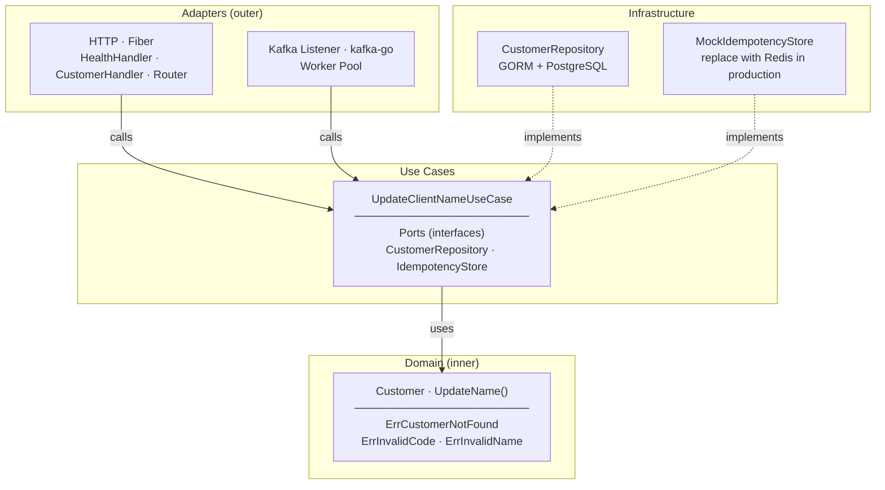
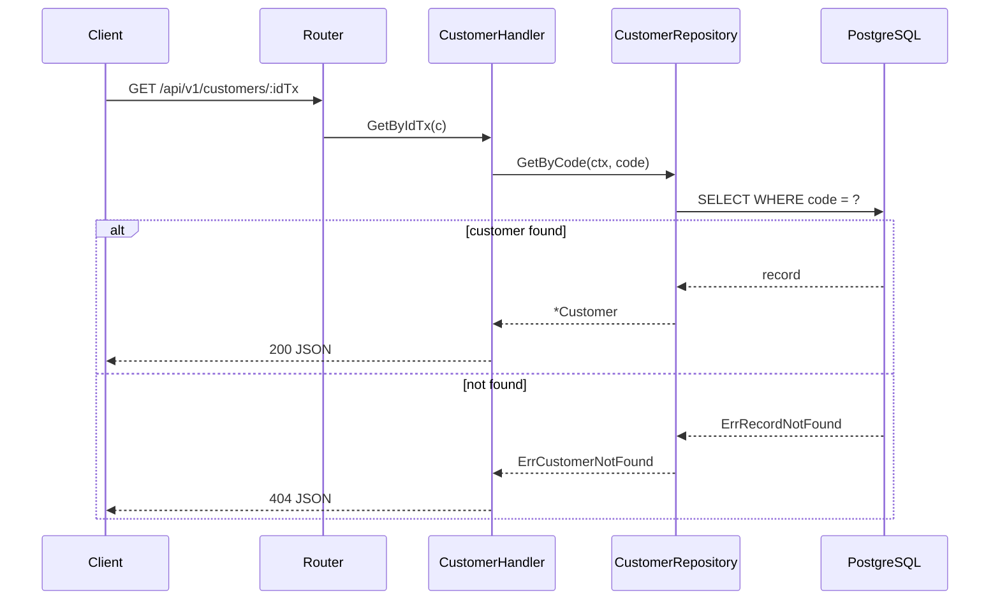
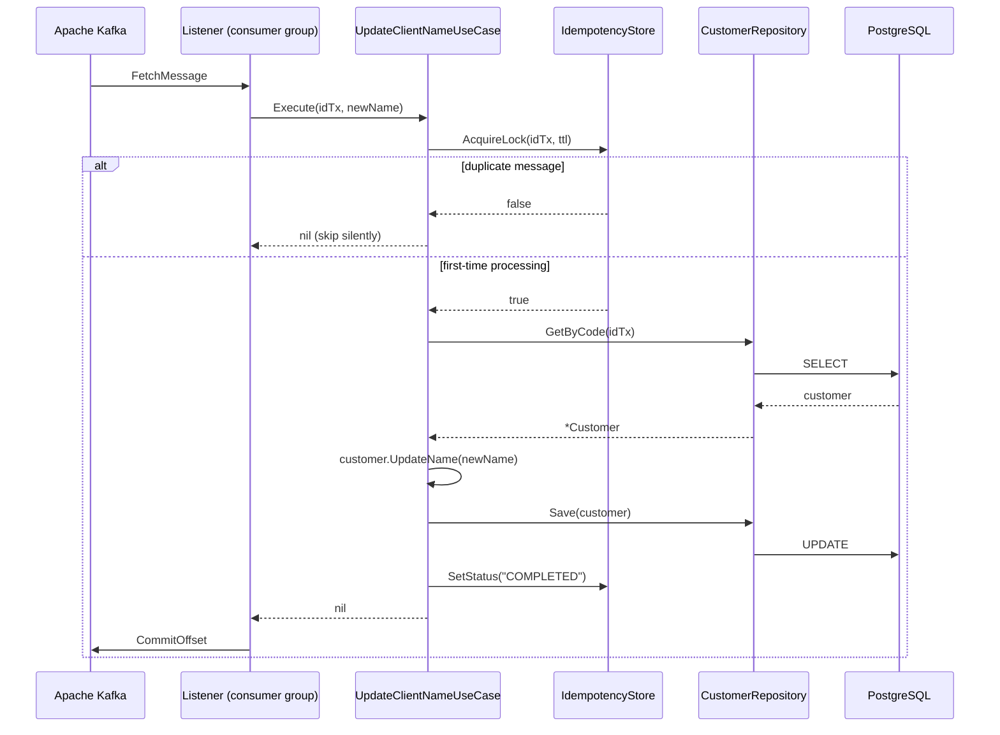
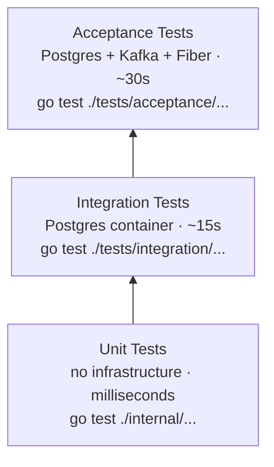

# Go Backend Template

Production-ready Go microservice template for the Cometa Gaming ecosystem. Scaffolds a fully-wired service in seconds — Kafka consumer, REST API, PostgreSQL persistence, three-tier test pyramid, Kubernetes manifests, and CI/CD — all following Clean / Hexagonal Architecture.

---

## Who Is This For?

| Audience | Goal | Start here |
|----------|------|-----------|
| **Service developer** | Generate a new microservice from this template | [Generate a Microservice](#generate-a-microservice) |
| **Template contributor** | Modify or extend this template | [Develop This Template](#develop-this-template) |

---

## Generate a Microservice

### Prerequisites

- `copier` CLI — `pipx install copier`
- Node.js 18.0.0+ and npm 9.0.0+ (for AIOX framework and git hooks)
- Go 1.25.4+
- Docker & Docker Compose

### Step 1 — Scaffold the project

```bash
copier copy https://github.com/cometagaming/go-back-end-template.git \
  --vcs-ref v1.0.0 \
  my-service \
  --defaults
```

**`--defaults` uses these values:**

| Variable | Default |
|----------|---------|
| `project_name` | My Microservice |
| `project_slug` | my-microservice |
| `github_org` | my-org |
| `default_port` | 8081 |
| `kafka_topic_default` | events |
| `k8s_namespace` | default |
| `go_version` | 1.25.4 |
| `api_version_prefix` | v1 |

**To set custom values interactively**, omit `--defaults`:
```bash
copier copy https://github.com/cometagaming/go-back-end-template.git \
  --vcs-ref v1.0.0 \
  my-service
```

### Step 1.5 — Initialize AIOX Framework

From the project root, initialize AIOX for story-driven development:

```bash
cd my-service
npm run setup
```

**What happens:**
- Installs the AIOX core framework via `npx aiox-core install`
- Syncs agent definitions to your IDE (`.claude/CLAUDE.md`, etc.)
- Configures Husky git hooks for story validation
- Verifies the setup with `npx aiox-core doctor`

**Prerequisites for this step:**
- Node.js 18.0.0+ (checked automatically)
- npm 9.0.0+ (checked automatically)
- `package.json` already exists in project root (created by copier)

**If npm run setup fails:**
If you see "package.json not found," the setup script will prompt you to create one:
```bash
# The setup script handles this automatically:
? Would you like me to create one? (y/n)
# Answer: y
```

Or manually:
```bash
npm init -y
npm run setup
```

**Expected output:**
```
═══════════════════════════════════════════════════════
  AIOX Framework Setup
═══════════════════════════════════════════════════════

→ Verifying environment...
✓ Node.js v20.10.0
✓ npm 10.2.0
✓ Platform: Linux (linux)

→ Installing AIOX core framework...
✓ AIOX core framework installed

→ Synchronizing agent definitions to IDE...
✓ IDE definitions synced

→ Configuring Husky git hooks...
✓ Husky already installed
✓ Husky initialized
✓ Git configured to use .husky hooks

→ Verifying installation...
✓ Node.js v20.10.0
✓ npm 10.2.0
✓ .aiox-core/ directory present
✓ 11 agents registered
✓ Agent definitions synced to .claude/
✓ .env configured

═══════════════════════════════════════════════════════
  Setup Complete!
═══════════════════════════════════════════════════════

Your project is now AIOX-ready!

Next steps:
  1. Create your first story: @sm *create-story
  2. Activate the developer agent: @dev
  3. View available commands: @dev *help
```

### Step 2 — Set up the generated project

```bash
cd application
```

Follow the full local setup guide: [LOCAL_DEVELOPMENT.md](LOCAL_DEVELOPMENT.md)

---

## Develop This Template

### Prerequisites

- Node.js 18.0.0+ and npm 9.0.0+ (for AIOX framework, Husky git hooks, and template scripts)
- Go 1.25.4+
- Docker & Docker Compose
- `copier` CLI — `pipx install copier`
- Git with SSH configured (required to push workflow files)

### Step 1 — Clone the repository

```bash
git clone git@github.com:cometagaming/go-back-end-template.git
cd go-back-end-template
```

### Step 2 — Initialize git hooks

```bash
npm run setup
```

This installs Husky and configures git to use `.husky/` for hooks. Only needed once per clone.

### Step 3 — Make your changes

Edit template files inside `application/`. All files support Jinja2 template variables using double square bracket delimiters (e.g. `project_slug`, `github_org`).

### Step 4 — Push

```bash
git add .
git commit -m "feat: your change"
git push origin your-branch
```

The pre-push hook runs `scripts/verify-template.sh` automatically — it scaffolds a full project from your changes and runs all tests. Push is blocked if verification fails.

### Quality Gates

| Stage | What runs | Blocks |
|-------|-----------|--------|
| Pre-commit (local) | `go test ./internal/...` | No |
| Pre-push (local) | `scripts/verify-template.sh` — full end-to-end | Yes |
| GitHub Actions CI | Scaffold → unit → integration → acceptance | No (informational) |

---

## Architecture

The generated project follows **Clean / Hexagonal Architecture**. Dependencies point inward: the domain has no external imports; infrastructure adapters implement interfaces defined by the use case layer.



**Layer order (inner → outer):** `domain → usecase → adapter → infrastructure`

---

## Directory Structure

```
application/
├── cmd/
│   └── api/
│       └── main.go              # Entry point: wiring, graceful shutdown
├── internal/
│   ├── domain/
│   │   └── customer.go          # Customer entity + sentinel errors
│   ├── usecase/
│   │   ├── ports.go             # CustomerRepository + IdempotencyStore interfaces
│   │   └── update_client_name.go # Core business logic
│   ├── adapter/
│   │   ├── http/
│   │   │   ├── handler/         # HealthHandler, CustomerHandler
│   │   │   └── router/          # Route registration
│   │   └── kafka/
│   │       └── listener.go      # Kafka consumer worker pool
│   ├── infrastructure/
│   │   ├── database/            # CustomerRepository (GORM)
│   │   └── idempotency/         # MockIdempotencyStore
│   └── config/
│       └── config.go            # Env var loading
├── tests/
│   ├── integration/             # Postgres container, no Kafka
│   └── acceptance/              # Full stack: Postgres + Kafka + Fiber
├── k8s/
│   ├── deployment.yaml
│   ├── service.yaml
│   └── ingress.yaml
└── .env.example
```

---

## Key Flows

### HTTP — GET /api/v1/customers/:idTx



### Async — Kafka Customer Name Update



### Idempotency Design

`IDEMPOTENCY_LOCK_TTL` controls the lock duration. When a message is received, a lock is acquired for that duration. If the same message is redelivered (Kafka at-least-once), `AcquireLock` returns `false` and the duplicate is silently dropped. If processing fails, `DeleteKey` releases the lock so the message can be retried when the consumer restarts or rebalances.

---

## API Reference

| Method | Path | Description |
|--------|------|-------------|
| `GET` | `/liveness` | Kubernetes liveness probe — always `200 OK` |
| `GET` | `/readiness` | Kubernetes readiness probe — `200` if DB reachable, `503` otherwise |
| `GET` | `/api/v1/customers/:idTx` | Retrieve customer by national registration code |

**Response 200**
```json
{ "id": 1, "code": "BR123456789", "name": "João Silva" }
```

**Response 404**
```json
{ "error": "customer not found" }
```

---

## Configuration

| Variable | Required | Default | Description |
|----------|----------|---------|-------------|
| `DATABASE_URL` | Yes | — | PostgreSQL connection string |
| `KAFKA_BROKERS` | Yes | — | Comma-separated broker addresses |
| `KAFKA_TOPIC` | Yes | — | Topic to consume customer update events from |
| `PORT` | No | `8081` | HTTP listen port |
| `KAFKA_GROUP_ID` | No | `casino-proxy-ai` | Kafka consumer group ID |
| `KAFKA_WORKERS` | No | `5` | Worker goroutine pool size |
| `IDEMPOTENCY_LOCK_TTL` | No | `30` | Idempotency lock duration (seconds) |
| `APP_ENV` | No | `development` | `development` \| `staging` \| `production` |

---

## Testing

Three-tier test pyramid — each tier runs independently.



```bash
make test           # Unit only
make integration    # Integration only
make acceptance     # Acceptance only
make test-all       # All in sequence
```

---

## Kubernetes Deployment

```bash
kubectl apply -f k8s/
```

Manifests expect `DATABASE_URL`, `KAFKA_BROKERS`, and `KAFKA_TOPIC` injected via environment.

---

## Tech Stack

| Concern | Library |
|---------|---------|
| HTTP framework | [Fiber v2](https://github.com/gofiber/fiber) |
| ORM | [GORM](https://gorm.io) + `gorm.io/driver/postgres` |
| Kafka client | [kafka-go](https://github.com/segmentio/kafka-go) (segmentio) |
| Integration tests | [Testcontainers for Go](https://golang.testcontainers.org) |
| Acceptance tests | [apitest](https://github.com/steinfletcher/apitest) |
| Kafka testcontainer | `testcontainers-go/modules/kafka` |
