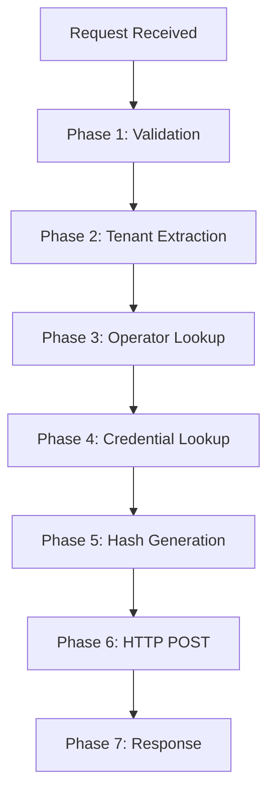

# Template: Provider Business Rules & Technical Documentation

**Status:** Template v1.0  
**Reference Implementation:** Pragmatic Play (CASINO-2.1 & CASINO-2.2)  
**Applies To:** All 8 providers × All endpoints  
**Last Updated:** 2026-05-12

---

## Overview

This template defines the **standard format and depth** for documenting business rules and endpoint flows for ALL gaming providers. It consists of **2 parts**:

### Part 1: Business Rules Extraction (Phase 1)
**File:** `/docs/casino-proxy/phase-1-business-rules/{PROVIDER}-rules.md`

Extract and document all business rules from the PHP service code.

### Part 2: Technical Endpoint Documentation (Phase 2)
**File:** `/docs/casino-proxy/phase-2-technical-documentation/{PROVIDER}-{ENDPOINT}.md`

Document technical flow of each endpoint showing how rules interact.

---

## Part 1: Business Rules Template

### File Structure
```
docs/casino-proxy/phase-1-business-rules/{PROVIDER}-rules.md
```

### Content Structure

```markdown
# Regras de Lógica de Negócio — {PROVIDER_NAME}

**Provider:** {Full Name}  
**Endpoints:** {Number of endpoints}  
**Authentication:** {Auth method: HMAC-MD5, HMAC-SHA256, etc}  
**Status:** Phase 1 Complete  
**Date Completed:** YYYY-MM-DD  
**Reference Implementation:** {Path to PHP service code}

---

## Executive Summary

**Regras extraídas:** {Number}
- List top 3-5 most critical rules
- Example: "All requests must be signed with HMAC-SHA256"

---

## Regras Extraídas

### Rule: {ID}
**Nomenclature:** BR-[TYPE]-[ENDPOINT]-[CONCERN]-[SEQUENCE]

Example format:
```
BR-GENERIC-ROUTING-VALIDATION-001
BR-PROVIDER-BALANCE-TOKEN-SANITIZATION-001
```

#### Template for Each Rule:

```markdown
### Rule: BR-{TYPE}-{ENDPOINT}-{CONCERN}-{SEQ}

**Descrição:** One sentence: What is validated/enforced

**Contexto de Negócio:** Why this rule exists (business/technical reason)

**Escopo:** Which endpoints trigger this rule
- /endpoint1
- /endpoint2

**Lógica de Decisão:** Pseudocódigo ou fluxo if-then-else
```
SE condition_1 E condition_2
  ENTÃO action_A
  SENÃO return error_code
```

**Casos Extremos:** Edge cases and invalid inputs
- Missing field X → Error code Y
- Invalid format → Error code Z
- Boundary condition → Behavior

**Código Fonte:** Exact file path and line numbers
- File: `app/Services/{Provider}Service.php`
- Lines: 45-52

**Dependências:** Which rules must pass first
- Depends on: BR-GENERIC-AUTH-001
- Must pass: BR-VALIDATION-002
```

---

## Matriz de Dependências

| Rule ID | Depends On | Blocks |
|---------|-----------|--------|
| BR-001 | — | BR-002, BR-003 |
| BR-002 | BR-001 | BR-004 |

---

## Questões Abertas

Document any ambiguities or unclear logic:
1. Question about X behavior
2. Clarification needed on Y logic
3. Edge case handling for Z

---

## Reference Implementation

**Service Class:** `app/Services/{Provider}Service.php`  
**Controller Class:** `app/Http/Controllers/{Provider}Controller.php`  
**Test Class:** `tests/Feature/{Provider}ServiceTest.php`
```

---

## Part 2: Technical Endpoint Documentation Template

### File Structure
```
docs/casino-proxy/phase-2-technical-documentation/{PROVIDER}-{ENDPOINT}.md
```

### Content Structure

```markdown
# Endpoint Documentation: /{ENDPOINT}

**Provider:** {Provider Name}  
**Endpoint:** POST /v1/webhooks/{provider}/{endpoint}  
**Purpose:** One sentence description  
**Rules Involved:** {Count} rules  
**Authentication:** {Method}

---

## Executive Summary

**O que faz:** One sentence business description
- Example: "Consults current player balance"

**Quando usado:** When/why this endpoint is called
- Example: "Client requests balance before/after bet"

---

## Fluxo Técnico em N Fases

### Mermaid Diagram


### Phase-by-Phase Breakdown

**FASE 1: {PHASE_NAME}**
- What happens: Clear description
- Rules applied: BR-001, BR-002
- Validation: What's checked
- Output: What's prepared

(Repeat for each phase)

---

## Matriz de Regras

| Phase | Rule ID | Rule Name | Input | Output | Error Case |
|-------|---------|-----------|-------|--------|-----------|
| 1 | BR-ROUTING-001 | Validate endpoint | method | route | 404 |
| 2 | BR-TENANT-001 | Extract tenant | token | operator_id | 401 |

---

## 5 Cenários de Erro

### Cenário 1: {Error Condition}
- **Trigger:** What causes this error
- **Rule:** Which rule catches it (BR-XXX)
- **HTTP Status:** 400/401/403/500
- **Response:** Error code and message
- **Validação:** How to test this

(Repeat for 4 more scenarios)

---

## Exemplo Completo (Request → Response)

### Request
```json
{
  "token": "operator1_abc123",
  "field1": "value1",
  "field2": 123.45
}
```

### Headers
```
POST /v1/webhooks/provider/endpoint HTTP/1.1
Hash: {HMAC-SHA256-BASE64}
Content-Type: application/json
```

### Response (Success)
```json
{
  "status": 0,
  "errorCode": 0,
  "data": {
    "field1": "value1",
    "field2": 123.45
  }
}
```

### Response (Error)
```json
{
  "status": 1,
  "errorCode": 401,
  "message": "Operator not found"
}
```

---

## Checklist de Segurança

- [ ] Tenant isolation validada (operator_id check)
- [ ] Hash authentication verificada (HMAC generation)
- [ ] Operator status validado (ativo/suspenso)
- [ ] Credential lookup funcionando
- [ ] Token sanitização correta (remove prefixo)
- [ ] Token wrapping correto (add prefixo)
- [ ] Error codes de segurança corretos
- [ ] No SQL injection (parameterized queries)
- [ ] No exposed sensitive data in response

---

## Referências Cruzadas

**Relacionado:**
- OpenAPI Spec: `/docs/openapi/specs/{provider}-spec.yaml`
- Business Rules: `/docs/casino-proxy/phase-1-business-rules/{provider}-rules.md`
- Trace Matrix: `/docs/casino-proxy/trace-matrices/{provider}-trace-matrix.yaml` (Phase 4)
- Test Cases: `casino-proxy-test-oracle/.../` (Phase 3)

---

**Template v1.0 — Approved Reference Implementation: Pragmatic Play**
```

---

## Creating Your Own Endpoint Documentation

### Step 1: Create Phase 1 (Business Rules)
1. Read the PHP service code: `app/Services/{Provider}Service.php`
2. Extract all validation and business logic
3. Create rule IDs using format: `BR-[TYPE]-[ENDPOINT]-[CONCERN]-[SEQ]`
4. Document each rule with: Description, Context, Scope, Logic, Code location, Dependencies
5. Create dependency matrix
6. Note any open questions

**Output:** `docs/casino-proxy/phase-1-business-rules/{provider}-rules.md`

### Step 2: Create Phase 2 (Technical Documentation)
1. For EACH endpoint in the provider, create a separate file
2. Design flow phases (5-8 phases typical)
3. Create Mermaid flowchart showing phase progression
4. Map each phase to specific business rules
5. Document 5+ error scenarios
6. Provide complete request/response examples
7. Create security checklist

**Output:** `docs/casino-proxy/phase-2-technical-documentation/{provider}-{endpoint}.md` (one file per endpoint)

### Step 3: Document Quality Checklist
- [ ] All endpoints documented
- [ ] All rules extracted from code
- [ ] Code locations exact (file + line numbers)
- [ ] Examples match actual request/response formats
- [ ] Error scenarios cover all BR rules
- [ ] Mermaid diagrams render correctly
- [ ] Security checklist complete
- [ ] Ready for Phase 3 (Test Oracle)

---

## Files Created From This Template

### Phase 1 (Business Rules) — One file per provider
```
docs/casino-proxy/phase-1-business-rules/
├── pragmatic-play-rules.md         ✅ TEMPLATE REFERENCE
├── evolution-gaming-rules.md        (Create using template)
├── pgsoft-rules.md
├── mancala-rules.md
├── digitain-rgs-rules.md
├── evoplay-rules.md
├── openbox-rules.md
└── alternar-rules.md
```

### Phase 2 (Endpoint Documentation) — One file per endpoint
```
docs/casino-proxy/phase-2-technical-documentation/
├── pragmatic-play-balance.md        ✅ TEMPLATE REFERENCE
├── pragmatic-play-authenticate.md   (Create using template)
├── pragmatic-play-bet.md
├── pragmatic-play-refund.md
│
├── evolution-authentication.md      (Create using template)
├── evolution-debit.md
├── evolution-credit.md
├── evolution-rollback.md
├── evolution-getNewToken.md
│
└── ... (repeat for remaining providers)
```

---

## Approval & Governance

**Template Status:** ✅ APPROVED (based on Pragmatic Play implementation)

**Mandatory for:** All 8 providers, all endpoints, all phases

**Review Required:** Before proceeding to Phase 3 (Test Oracle), Phase 1 and 2 docs must be 100% complete for that provider

**Variations Allowed:** 
- None at Phase 1-2 level (must follow template)
- Phase 3+ (Test Oracle) may vary based on endpoint complexity

---

**This template is the SINGLE SOURCE OF TRUTH for Phase 1 & Phase 2 documentation across CASINO-2.**
