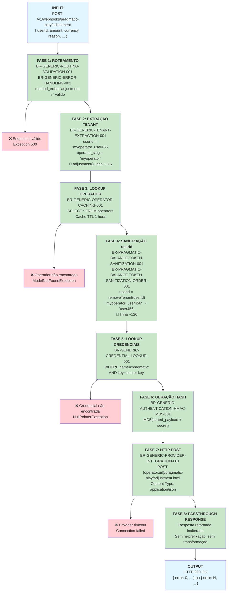

# Pragmatic Play `/adjustment` Endpoint — Documentação Técnica

**Endpoint:** `POST /v1/webhooks/pragmatic-play/adjustment`  
**Provider:** Pragmatic Play  
**Funcionalidade:** Aplicar ajuste/correção administrativa de saldo do jogador  
**Status:** ✅ Documentação Fase 2 — Encerra a documentação de todos os 9 endpoints  

> ⚙️ **Standalone — Lógica Inline:** `/adjustment` não pertence à família handleResult(). Assim como `/bet` e `/refund`, implementa lógica diretamente no método `adjustment()` (linhas ~114-127). É o **único endpoint não-handleResult() após o /refund** e o **único iniciado pelo operador** (não pelo provider).

---

## 1. Resumo Executivo

O endpoint `/adjustment` aplica uma correção administrativa de saldo de um jogador. É o único endpoint do Pragmatic Play **iniciado pelo operador** — não pelo provider em resposta a um evento de jogo. Exemplos de uso: erros de processamento, estornos manuais, reconciliações de saldo. O Casino Proxy executa o mesmo fluxo de 8 fases dos endpoints de transação: extrai o tenant do `userId`, busca credenciais, assina com MD5 e faz POST para o provider. A resposta é retornada **sem nenhuma modificação** (passthrough direto).

**Características:**
- ✅ Usa **apenas `userId`** como identificador
- ✅ **Passthrough** da resposta do provider — sem transformação
- ✅ Requer autenticação via hash MD5
- ✅ Multi-tenant com isolamento de operador
- ✅ **Sem regras exclusivas** — mesmas 9 regras genéricas do `/bet`
- ⚙️ **Lógica inline** — mesmo padrão de `/bet` e `/refund` (não usa `handleResult()`)
- 🔑 **Iniciador:** Operador (não o provider) — ajuste administrativo, não evento de jogo

**Fonte PHP:** `PragmaticPlayService.php` — método `adjustment()`, linhas ~114-127  
**userId:** removido na linha ~120

---

## 2. Fluxo de Requisição (Request → Response)



### Explicação das Fases

| Fase | Nome | Regra | Descrição |
|------|------|-------|-----------|
| 1 | Roteamento | BR-GENERIC-ROUTING-VALIDATION-001 + BR-GENERIC-ERROR-HANDLING-001 | `method_exists($service, 'adjustment')` → válido. Execução continua no próprio `adjustment()` — sem delegação. |
| 2 | Extração Tenant | BR-GENERIC-TENANT-EXTRACTION-001 | `operatorService->get($data['userId'])` → extrai `operator_slug`. Linha ~115. |
| 3 | Lookup Operador | BR-GENERIC-OPERATOR-CACHING-001 | Cache Redis TTL 1h. `firstOrFail()` lança exceção se não encontrado. |
| 4 | Sanitização | BR-PRAGMATIC-BALANCE-TOKEN-SANITIZATION-001 + ORDER-001 | `removeTenant(userId)` remove o prefixo `operator_slug_`. Linha ~120. Campo único. |
| 5 | Lookup Credenciais | BR-GENERIC-CREDENTIAL-LOOKUP-001 | `credentials.where('name','pragmatic').where('key','secret-key').first()->value`. Linha ~121. |
| 6 | Geração Hash | BR-GENERIC-AUTHENTICATION-HMAC-MD5-001 | `generateHashCode($data, $secret)`. Linha ~123. |
| 7 | HTTP POST | BR-GENERIC-PROVIDER-INTEGRATION-001 | `postJson("{operator.url}/pragmatic-play/adjustment.html", $data)`. Linha ~125. |
| 8 | Passthrough | — | Resposta do provider retornada **sem nenhuma modificação**. |

---

## 3. Matriz de Regras Aplicáveis

| # | Regra | Descrição | Fase | Exclusiva? |
|---|-------|-----------|------|------------|
| 1 | **BR-GENERIC-ROUTING-VALIDATION-001** | Dynamic Endpoint Routing | 1 | Não |
| 2 | **BR-GENERIC-ERROR-HANDLING-001** | Unknown endpoint → Exception 500 | 1 (guard) | Não |
| 3 | **BR-GENERIC-TENANT-EXTRACTION-001** | Extrair `operator_slug` do `userId` | 2 | Não |
| 4 | **BR-GENERIC-OPERATOR-CACHING-001** | Operator lookup com cache 1h | 3 | Não |
| 5 | **BR-PRAGMATIC-BALANCE-TOKEN-SANITIZATION-001** | Remover prefixo tenant do `userId` | 4 | Não |
| 6 | **BR-PRAGMATIC-BALANCE-TOKEN-SANITIZATION-ORDER-001** | Sanitização de `userId` (campo único) | 4 | Não |
| 7 | **BR-GENERIC-CREDENTIAL-LOOKUP-001** | Buscar `secret-key` do operador | 5 | Não |
| 8 | **BR-GENERIC-AUTHENTICATION-HMAC-MD5-001** | Gerar hash MD5 (sort + concat + md5) | 6 | Não |
| 9 | **BR-GENERIC-PROVIDER-INTEGRATION-001** | HTTP POST para `{tenant_url}/pragmatic-play/adjustment.html` | 7 | Não |

> **Fase 8:** Passthrough direto — sem regra adicional. Resposta do provider retornada inalterada.  
> **Fonte das regras:** `docs/casino-proxy/phase-1-business-rules/pragmatic-play-rules.md`

### Lógica Inline — Código PHP `adjustment()`

```php
// adjustment() — lógica inline, sem delegação (PragmaticPlayService.php:114-127)
public function adjustment($data) {
    $tenant = $this->operatorService->get($data['userId']);        // linha ~115
    $data['userId'] = $this->removeTenant($data['userId']);        // linha ~120
    $secret = $tenant->credentials()
        ->where('name', 'pragmatic')
        ->where('key', 'secret-key')
        ->first()->value;                                           // linha ~121
    $data['hash'] = $this->generateHashCode($data, $secret);      // linha ~123
    return $this->postJson(
        $tenant['url'] . '/pragmatic-play/adjustment.html', $data  // linha ~125
    );
}
```

> Estrutura idêntica a `bet()` (linhas ~64-77) e `refund()` (linhas ~79-92) — apenas o nome do método e a URL de destino diferem.

---

## 4. Casos de Erro e Tratamento

### 4.1 `userId` Faltando no Payload

**Entrada:**
```json
{ "amount": 50.00, "currency": "BRL", "reason": "reconciliation" }
```

**Falha em:** Fase 2 — `$data['userId']` é null

**Saída:**
```
Exception: Não foi possível encontrar um operator na string {null}
HTTP 500 Internal Server Error
```

---

### 4.2 `userId` sem Underscore (Formato Inválido)

**Entrada:**
```json
{ "userId": "semseparador", "amount": 50.00, "currency": "BRL" }
```

**Falha em:** Fase 2 — parse do `operator_slug` falha

**Saída:**
```
Exception: Não foi possível encontrar um operator na string semseparador
HTTP 500 Internal Server Error
```

---

### 4.3 Operador Não Encontrado

**Entrada:**
```json
{ "userId": "operadorinexistente_user123", "amount": 50.00, "currency": "BRL" }
```

**Falha em:** Fase 3 — `firstOrFail()` lança exceção

**Saída:**
```
Exception: No query results for model [App\Models\Operator]
HTTP 500 Internal Server Error
```

---

### 4.4 Credencial Pragmatic Faltando

**Falha em:** Fase 5 — `credentials->first()` retorna null

**Saída:**
```
Exception: Call to a member function value() on null
HTTP 500 Internal Server Error
```

---

### 4.5 Provider Timeout

**Falha em:** Fase 7 — `postJson()` sem retry (BaseService:19)

**Saída:**
```
Exception: Connection timeout / cURL error
HTTP 500 Internal Server Error
```

---

### 4.6 Ajuste Rejeitado pelo Provider (`error != 0`)

**Provider responde:**
```json
{ "error": 6, "description": "Adjustment not allowed for this account" }
```

**Comportamento em Fase 8:** Passthrough inalterado

**Saída para o cliente:**
```json
{ "error": 6, "description": "Adjustment not allowed for this account" }
```

---

## 5. Exemplo Completo: Request → Response

### 5.1 Caso de Sucesso

**Cliente envia:**
```bash
curl -X POST http://localhost:8080/v1/webhooks/pragmatic-play/adjustment \
  -H "Content-Type: application/json" \
  -d '{
    "userId": "myoperator_user456",
    "amount": 50.00,
    "currency": "BRL",
    "transactionId": "txn_adj_001",
    "reason": "manual_reconciliation"
  }'
```

**Processamento interno:**

| Fase | Operação | Input | Output |
|------|----------|-------|--------|
| 1 | Routing | endpoint="adjustment" | `method_exists` → ✅ (lógica inline, sem delegação) |
| 2 | Tenant Extraction | userId="myoperator_user456" (linha ~115) | operator_slug="myoperator" |
| 3 | Operator Lookup | slug="myoperator" | Operador + credentials (cache TTL 1h) |
| 4 | Sanitização | userId="myoperator_user456" (linha ~120) | userId="user456" |
| 5 | Credencial | operador.credentials (linha ~121) | secret="my_pp_secret_key" |
| 6 | Hash MD5 | sorted payload + secret (linha ~123) | hash="a2b3c4d5e6f7..." |
| 7 | HTTP POST | `{url}/pragmatic-play/adjustment.html` (linha ~125) | provider response recebida |
| 8 | **Passthrough** | response do provider | retornada inalterada |

**Payload enviado ao provider (após sanitização e hash):**
```json
{
  "userId": "user456",
  "amount": 50.00,
  "currency": "BRL",
  "transactionId": "txn_adj_001",
  "reason": "manual_reconciliation",
  "hash": "a2b3c4d5e6f7..."
}
```

**Provider responde:**
```json
{
  "error": 0,
  "description": "Success",
  "transactionId": "txn_adj_001",
  "currency": "BRL",
  "cash": 1550.50,
  "bonus": 0.00
}
```

**Casino Proxy retorna (passthrough — inalterado):**
```bash
HTTP 200 OK
Content-Type: application/json

{
  "error": 0,
  "description": "Success",
  "transactionId": "txn_adj_001",
  "currency": "BRL",
  "cash": 1550.50,
  "bonus": 0.00
}
```

---

## 6. Contexto de Negócio: Ajuste Administrativo vs. Eventos de Jogo

O `/adjustment` é o único endpoint do Pragmatic Play que **não corresponde a um evento de jogo**:

| Aspecto | Endpoints de Jogo (`bet`, `refund`, `result`, família handleResult) | `/adjustment` |
|---------|---------------------------------------------------------------------|--------------|
| **Iniciador** | Provider (Pragmatic Play) — em resposta a ação do jogador | **Operador** — decisão administrativa |
| **Trigger** | Rodada iniciada, resultado apurado, bônus ativado | Erro de processamento, reconciliação, estorno manual |
| **Frequência** | Alta (fluxo normal de jogo) | Baixa (eventos excepcionais) |
| **Contexto** | Eventos em tempo real durante o jogo | Correções pós-evento, reconciliações |
| **Auditoria** | Rastreamento de rodadas | Rastreamento de ajustes administrativos |
| **Implementação** | Lógica inline ou handleResult() | **Lógica inline** (como bet/refund) |

### Quando `/adjustment` é chamado

- **Erro de processamento:** Um `/result` falhou; o operador envia um ajuste para compensar
- **Estorno manual:** Operador precisa devolver fundos por motivo não coberto pelo `/refund`
- **Reconciliação:** Diferença identificada entre o saldo no sistema do operador e no provider
- **Compensação regulatória:** Ajuste exigido por auditoria ou regulador

---

## 7. Visão Geral dos 9 Endpoints — Grupos de Implementação

Com `/adjustment`, a documentação da Fase 2 está **completa**. Todos os 9 endpoints organizados por padrão de implementação:

| Grupo | Endpoints | Implementação | Identificador | Response |
|-------|-----------|---------------|--------------|---------|
| **Sessão** | `authenticate` | Inline + transformação response | `token` | Re-prefixa `userId` se `error==0` |
| **Consulta** | `balance` | Inline + dual token | `token` ou `userId` | Passthrough |
| **Transação inline** | `bet`, `refund`, `adjustment` | Lógica direta no método | `userId` | Passthrough |
| **handleResult() family** | `result`, `bonusWin`, `jackpotWin`, `promoWin` | Thin wrapper → `handleResult()` | `userId` | Passthrough |

### Mapa de Regras por Grupo

| Grupo | Regras Genéricas | Regras Exclusivas | Total |
|-------|-----------------|-------------------|-------|
| Sessão (`authenticate`) | 7 | PP-007, PP-012 | 9 |
| Consulta (`balance`) | 9 | BR-PRAGMATIC-BALANCE-DUAL-TOKEN-SUPPORT-001 | 10 |
| Transação inline (`bet`, `refund`, `adjustment`) | 9 | Nenhuma | 9 cada |
| handleResult() family | 9 | Nenhuma | 9 cada |

---

## 8. Checklist de Segurança

| Validação | Implementada | Regra | Severidade |
|-----------|-------------|-------|------------|
| Tenant isolation (prefixo no userId) | ✅ | BR-GENERIC-TENANT-EXTRACTION-001 | CRÍTICA |
| Sanitização do userId antes de envio ao provider | ✅ | BR-PRAGMATIC-BALANCE-TOKEN-SANITIZATION-001 | CRÍTICA |
| Hash authentication (MD5) | ✅ | BR-GENERIC-AUTHENTICATION-HMAC-MD5-001 | CRÍTICA |
| Credencial por operador (secret-key isolado) | ✅ | BR-GENERIC-CREDENTIAL-LOOKUP-001 | CRÍTICA |
| Validação de endpoint (routing guard) | ✅ | BR-GENERIC-ERROR-HANDLING-001 | MÉDIA |
| HTTP method (POST only) | ✅ | routes/api.php | MÉDIA |

---

## 9. Limites e Restrições

| Restrição | Limite / Comportamento | Impacto |
|-----------|----------------------|---------|
| Identificador de entrada | Apenas `userId` (sem `token`) | Clientes devem sempre enviar `userId` |
| Formato do `userId` | Deve conter `_` como delimitador | `userId` sem `_` causa erro 500 |
| Response | Passthrough direto — sem transformação | O Casino Proxy não modifica o resultado do provider |
| Cache de operador | TTL 1 hora | Mudanças no operador levam até 1h para refletir |
| Retry automático | Desabilitado (BaseService:19) | Timeout do provider = falha imediata |
| Hash algorithm | MD5 | Compatibilidade com protocolo Pragmatic Play |
| Frequência de uso | Baixa — eventos excepcionais | Não otimizado para alto volume |

---

## 10. Referências

| Arquivo | Propósito |
|---------|-----------|
| `legacy/casino-proxy/app/Services/PragmaticPlayService.php:114-127` | Implementação `adjustment()` |
| `PragmaticPlayService.php:120` | Sanitização do `userId` (`removeTenant`) |
| `PragmaticPlayService.php:132-137` | Método `removeTenant()` |
| `PragmaticPlayService.php:142-152` | Método `generateHashCode()` |
| `OperatorService.php:20-34` | Método `get()` (tenant extraction + cache) |
| `BaseService.php:16-22` | Método `postJson()` |
| `docs/casino-proxy/phase-1-business-rules/pragmatic-play-rules.md` | Fonte das regras BR-* |
| `docs/casino-proxy/phase-2-technical-documentation/pragmatic-play-bet.md` | Template base (mesmo padrão inline) |

---

**Status:** ✅ Documentação Técnica Completa — Pronta para @qa review  
**Fase 2:** ✅ **ENCERRADA** — Todos os 9 endpoints do Pragmatic Play documentados
