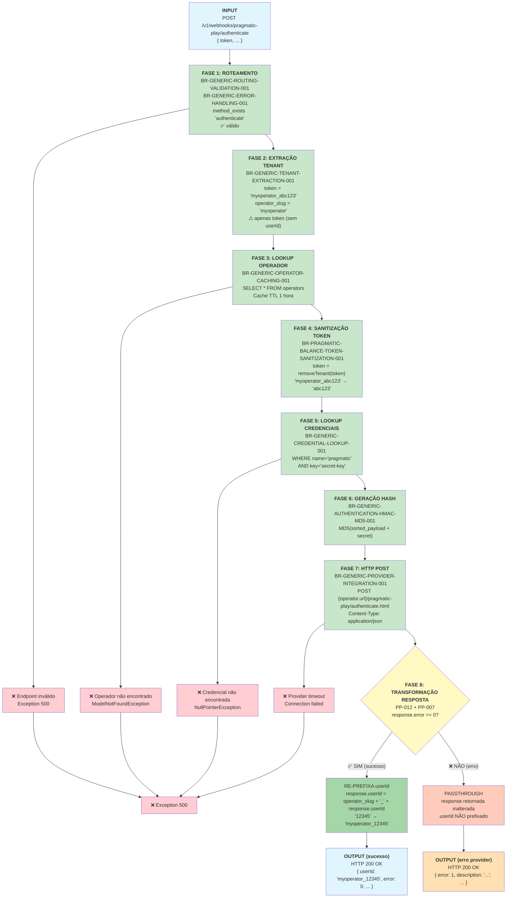

# Pragmatic Play `/authenticate` Endpoint — Documentação Técnica

**Endpoint:** `POST /v1/webhooks/pragmatic-play/authenticate`  
**Provider:** Pragmatic Play  
**Funcionalidade:** Autenticar jogador e retornar `userId` prefixado com tenant  
**Status:** ✅ Documentação Fase 2  

> ⚠️ **Endpoint Único:** `/authenticate` é o **único endpoint do Pragmatic Play que transforma a resposta**. Todos os demais (balance, bet, refund, result, etc.) fazem passthrough direto. A re-prefixação do `userId` na resposta (regras PP-007 + PP-012) é exclusiva deste endpoint.

---

## 1. Resumo Executivo

O endpoint `/authenticate` valida a identidade de um jogador junto ao backend do operador. Ao contrário de todos os outros endpoints, **transforma a resposta** recebida do provider: se a autenticação for bem-sucedida (`error == 0`), re-prefixa o `userId` retornado com o `operator_slug` do tenant.

**Características:**
- ✅ Usa **apenas `token`** (sem suporte a `userId` como identificador de entrada)
- ✅ **Transforma** a resposta em caso de sucesso (re-prefixação do `userId`)
- ✅ Passthrough inalterado em caso de erro (`error != 0`)
- ✅ Requer autenticação via hash MD5
- ✅ Multi-tenant com isolamento de operador
- ⚠️ **Regras exclusivas:** PP-007 (Response Re-Prefixing) + PP-012 (Authenticate Only)

**Fonte PHP:** `PragmaticPlayService.php` — método `authenticate()`, linhas ~26-44

---

## 2. Fluxo de Requisição (Request → Response)



---

## 3. Matriz de Regras Aplicáveis

| # | Regra | Descrição | Fase | Exclusiva? |
|---|-------|-----------|------|------------|
| 1 | **BR-GENERIC-ROUTING-VALIDATION-001** | Dynamic Endpoint Routing | 1 | Não |
| 2 | **BR-GENERIC-ERROR-HANDLING-001** | Unknown endpoint → Exception 500 | 1 (guard) | Não |
| 3 | **BR-GENERIC-TENANT-EXTRACTION-001** | Extrair `operator_slug` do `token` | 2 | Não |
| 4 | **BR-GENERIC-OPERATOR-CACHING-001** | Operator lookup com cache 1h | 3 | Não |
| 5 | **BR-PRAGMATIC-BALANCE-TOKEN-SANITIZATION-001** | Remover prefixo tenant do `token` | 4 | Não |
| 6 | **BR-GENERIC-CREDENTIAL-LOOKUP-001** | Buscar `secret-key` do operador | 5 | Não |
| 7 | **BR-GENERIC-AUTHENTICATION-HMAC-MD5-001** | Gerar hash MD5 (sort + concat + md5) | 6 | Não |
| 8 | **BR-GENERIC-PROVIDER-INTEGRATION-001** | HTTP POST para `{tenant_url}/pragmatic-play/authenticate.html` | 7 | Não |
| 9 | **PP-012** (inclui **PP-007**) | Re-prefixar `userId` na resposta se `error == 0` | 8 | **SIM** |

> **Nota:** O `/authenticate` não aplica BR-PRAGMATIC-BALANCE-DUAL-TOKEN-SUPPORT-001 (dual token) nem BR-PRAGMATIC-BALANCE-TOKEN-SANITIZATION-ORDER-001 (ordem de sanitização) pois usa apenas `token` como identificador de entrada.

---

## 4. Comportamento de Re-Prefixação (PP-007 / PP-012)

Este é o comportamento mais crítico e exclusivo do `/authenticate`:

```
response = postJson("{tenant_url}/pragmatic-play/authenticate.html", payload)

SE response['error'] == 0:          // sucesso
    response['userId'] = operator_slug + '_' + response['userId']
    // ex: "12345" → "myoperator_12345"

// SE error != 0: response retornada inalterada — userId NÃO re-prefixado

RETURN response
```

**Código Fonte:** `PragmaticPlayService.php:40-42`

### Por que re-prefixar?

O provider retorna o `userId` "limpo" (ex: `"12345"`). O sistema Casino Proxy usa prefixo de tenant para rastrear qual operador cada usuário pertence. O cliente (frontend/backend do operador) precisa receber o `userId` prefixado para identificar o tenant nas requisições subsequentes (balance, bet, etc.).

### Casos extremos de PP-007

| Cenário | Comportamento |
|---------|--------------|
| `error == 0` e `userId` presente | Re-prefixação: `"myop_" + userId` |
| `error != 0` (qualquer valor) | Passthrough — userId NÃO modificado |
| `userId` ausente na resposta (`error == 0`) | Concatenação com string vazia: `"myop_"` — **edge case não tratado** |
| `error` field ausente na resposta | Comparação com 0 falha — tratado como `error != 0` (passthrough) |

---

## 5. Casos de Erro e Tratamento

### 5.1 Token Faltando no Payload

**Entrada:**
```json
{ "currency": "BRL" }
```

**Falha em:** Fase 2 — BR-GENERIC-TENANT-EXTRACTION-001

**Saída:**
```
Exception: Não foi possível encontrar um operator na string {null}
HTTP 500 Internal Server Error
```

---

### 5.2 Token sem Underscore (Formato Inválido)

**Entrada:**
```json
{ "token": "semunderscore", "currency": "BRL" }
```

**Falha em:** Fase 2 — parse do `operator_slug` falha (sem delimitador `_`)

**Saída:**
```
Exception: Não foi possível encontrar um operator na string semunderscore
HTTP 500 Internal Server Error
```

---

### 5.3 Operador Não Encontrado

**Entrada:**
```json
{ "token": "operadorinexistente_abc123", "currency": "BRL" }
```

**Falha em:** Fase 3 — BR-GENERIC-OPERATOR-CACHING-001 (`firstOrFail()` lança exceção)

**Saída:**
```
Exception: No query results for model [App\Models\Operator]
HTTP 500 Internal Server Error
```

---

### 5.4 Credencial Pragmatic Faltando

**Entrada:**
```json
{ "token": "myoperator_abc123", "currency": "BRL" }
```

**Falha em:** Fase 5 — BR-GENERIC-CREDENTIAL-LOOKUP-001 (`.first()` retorna null, `.value` lança exceção)

**Saída:**
```
Exception: Call to a member function value() on null
HTTP 500 Internal Server Error
```

---

### 5.5 Provider Timeout

**Falha em:** Fase 7 — BR-GENERIC-PROVIDER-INTEGRATION-001 (sem retry — BaseService:19)

**Saída:**
```
Exception: Connection timeout / cURL error
HTTP 500 Internal Server Error
```

---

### 5.6 Autenticação Rejeitada pelo Provider (`error != 0`)

**Entrada:** Payload válido, mas hash incorreto ou sessão inválida no provider

**Provider responde:**
```json
{ "error": 1, "description": "Invalid token" }
```

**Comportamento em Fase 8 (PP-007/PP-012):**
- `error != 0` → passthrough inalterado
- `userId` **não** re-prefixado

**Saída para o cliente:**
```json
{ "error": 1, "description": "Invalid token" }
```

---

## 6. Exemplo Completo: Request → Response

### 6.1 Caso de Sucesso — Com Re-Prefixação

**Cliente envia:**
```bash
curl -X POST http://localhost:8080/v1/webhooks/pragmatic-play/authenticate \
  -H "Content-Type: application/json" \
  -d '{
    "token": "myoperator_session_abc123",
    "currency": "BRL"
  }'
```

**Processamento interno:**

| Fase | Operação | Input | Output |
|------|----------|-------|--------|
| 1 | Routing | endpoint="authenticate" | `method_exists` → ✅ |
| 2 | Tenant Extraction | token="myoperator_session_abc123" | operator_slug="myoperator" |
| 3 | Operator Lookup | slug="myoperator" | Operador + credentials carregados (cache) |
| 4 | Sanitização | token="myoperator_session_abc123" | token="session_abc123" |
| 5 | Credencial | operador.credentials | secret="my_pp_secret_key" |
| 6 | Hash MD5 | sorted payload + secret | hash="d41d8cd98f00b204..." |
| 7 | HTTP POST | `{url}/pragmatic-play/authenticate.html` | provider response recebida |
| 8 | **Re-prefixação (PP-007)** | response.error=0, response.userId="12345" | response.userId="myoperator_12345" |

**Provider responde (antes da Fase 8):**
```json
{
  "userId": "12345",
  "error": 0,
  "description": "Success",
  "currency": "BRL",
  "cash": 1500.50,
  "bonus": 0.00
}
```

**Casino Proxy retorna (após re-prefixação):**
```bash
HTTP 200 OK
Content-Type: application/json

{
  "userId": "myoperator_12345",
  "error": 0,
  "description": "Success",
  "currency": "BRL",
  "cash": 1500.50,
  "bonus": 0.00
}
```

---

### 6.2 Caso de Erro — Sem Re-Prefixação

**Provider responde:**
```json
{
  "error": 1,
  "description": "Invalid token or session expired"
}
```

**Fase 8:** `error != 0` → passthrough, sem re-prefixação

**Casino Proxy retorna (inalterado):**
```bash
HTTP 200 OK
Content-Type: application/json

{
  "error": 1,
  "description": "Invalid token or session expired"
}
```

> **Nota:** Mesmo em caso de erro do provider, o HTTP status retornado pelo Casino Proxy é 200 OK. O campo `error` dentro do JSON é o indicador de sucesso/falha da operação.

---

## 7. Comparação: `/authenticate` vs `/balance`

| Característica | `/authenticate` | `/balance` |
|---------------|----------------|------------|
| **Identificador de entrada** | `token` apenas | `token` OU `userId` (dual) |
| **Dual token support** | ❌ Não | ✅ Sim (BR-PRAGMATIC-BALANCE-DUAL-TOKEN-SUPPORT-001) |
| **Sanitização** | Apenas `token` | `token` + `userId` (se presentes) |
| **Transforma response** | ✅ **Sim** — re-prefixa `userId` se `error==0` | ❌ Não — passthrough direto |
| **Regras exclusivas** | PP-007 + PP-012 | BR-PRAGMATIC-BALANCE-DUAL-TOKEN-SUPPORT-001 |
| **Total de regras** | 9 | 10 |
| **URL destino** | `.../authenticate.html` | `.../balance.html` |
| **Tipo** | Sessão / Autenticação | Consulta |
| **Fonte PHP** | `authenticate()` linhas ~26-44 | `balance()` linhas ~48-62 |
| **Fase 8** | Transformação condicional | Passthrough |

---

## 8. Checklist de Segurança

| Validação | Implementada | Regra | Severidade |
|-----------|-------------|-------|------------|
| Tenant isolation (prefixo no token) | ✅ | BR-GENERIC-TENANT-EXTRACTION-001 | CRÍTICA |
| Sanitização antes de envio ao provider | ✅ | BR-PRAGMATIC-BALANCE-TOKEN-SANITIZATION-001 | CRÍTICA |
| Hash authentication (MD5) | ✅ | BR-GENERIC-AUTHENTICATION-HMAC-MD5-001 | CRÍTICA |
| Credencial por operador | ✅ | BR-GENERIC-CREDENTIAL-LOOKUP-001 | CRÍTICA |
| Re-prefixação apenas em sucesso | ✅ | PP-007 / PP-012 | ALTA |
| Validação de endpoint (routing guard) | ✅ | BR-GENERIC-ERROR-HANDLING-001 | MÉDIA |
| HTTP method (POST only) | ✅ | routes/api.php | MÉDIA |

---

## 9. Limites e Restrições

| Restrição | Limite / Comportamento | Impacto |
|-----------|----------------------|---------|
| Identificador de entrada | Apenas `token` (sem `userId`) | Clientes devem sempre enviar `token` |
| Formato do token | Deve conter `_` como delimitador | Tokens sem `_` causam erro 500 |
| Re-prefixação | Condicional: apenas se `error == 0` | `error != 0` retorna response inalterada |
| Cache de operador | TTL 1 hora | Mudanças no operador levam até 1h para refletir |
| Retry automático | Desabilitado (BaseService:19) | Timeout do provider = falha imediata |
| Hash algorithm | MD5 | Compatibilidade com protocolo Pragmatic Play |
| `userId` ausente em sucesso | Concatenação com vazio `"myop_"` | Edge case não tratado — risco em provider com schema variável |

---

## 10. Referências

| Arquivo | Propósito |
|---------|-----------|
| `legacy/casino-proxy/app/Services/PragmaticPlayService.php:26-44` | Implementação `authenticate()` |
| `PragmaticPlayService.php:40-42` | Lógica de re-prefixação (PP-007) |
| `PragmaticPlayService.php:132-137` | Método `removeTenant()` |
| `PragmaticPlayService.php:142-152` | Método `generateHashCode()` |
| `OperatorService.php:20-34` | Método `get()` (tenant extraction + cache) |
| `BaseService.php:16-22` | Método `postJson()` |
| `docs/casino-proxy/phase-1-business-rules/pragmatic-play-rules.md` | Fonte das regras BR-* e PP-* |
| `docs/casino-proxy/phase-2-technical-documentation/pragmatic-play-balance.md` | Template base desta documentação |

---

**Status:** ✅ Documentação Técnica Completa — Pronta para @qa review
