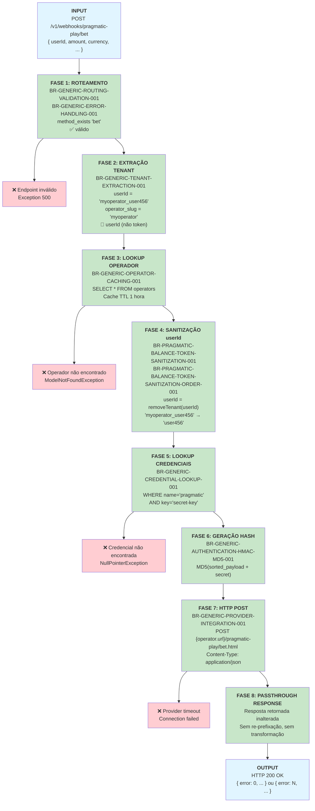

# Pragmatic Play `/bet` Endpoint — Documentação Técnica

**Endpoint:** `POST /v1/webhooks/pragmatic-play/bet`  
**Provider:** Pragmatic Play  
**Funcionalidade:** Registrar aposta do jogador e retornar resposta do provider sem transformação  
**Status:** ✅ Documentação Fase 2  

> 📌 **Padrão Canônico de Transação:** `/bet` é o modelo de referência para os endpoints de transação do Pragmatic Play. Usa `userId` como identificador, aplica as 9 regras genéricas sem nenhuma exclusiva, e faz passthrough direto da resposta. Os endpoints `/refund`, `/result`, `/bonusWin`, `/jackpotWin` e `/promoWin` seguem o mesmo padrão base.

---

## 1. Resumo Executivo

O endpoint `/bet` registra uma aposta do jogador. O Casino Proxy extrai o tenant do `userId`, busca as credenciais do operador, assina o payload com hash MD5 e faz o POST para o backend do provider. A resposta é retornada **sem nenhuma modificação** (passthrough direto).

**Características:**
- ✅ Usa **apenas `userId`** como identificador (sem `token`)
- ✅ **Passthrough** da resposta do provider — sem transformação alguma
- ✅ Requer autenticação via hash MD5
- ✅ Multi-tenant com isolamento de operador
- ✅ **Sem regras exclusivas** — aplica apenas as 9 regras genéricas
- 📌 Modelo para: `/refund`, `/result`, `/bonusWin`, `/jackpotWin`, `/promoWin`

**Fonte PHP:** `PragmaticPlayService.php` — método `bet()`, linhas ~64-77

---

## 2. Fluxo de Requisição (Request → Response)



### Explicação das Fases

| Fase | Nome | Regra | Descrição |
|------|------|-------|-----------|
| 1 | Roteamento | BR-GENERIC-ROUTING-VALIDATION-001 + BR-GENERIC-ERROR-HANDLING-001 | `method_exists($service, 'bet')` → válido. Endpoint desconhecido lança Exception 500. |
| 2 | Extração Tenant | BR-GENERIC-TENANT-EXTRACTION-001 | `userId.split('_')[0]` → `operator_slug`. Usa `userId` (não `token`). |
| 3 | Lookup Operador | BR-GENERIC-OPERATOR-CACHING-001 | `OperatorService::get(userId)` com cache Redis TTL 1h. `firstOrFail()` lança exceção se não encontrado. |
| 4 | Sanitização | BR-PRAGMATIC-BALANCE-TOKEN-SANITIZATION-001 + ORDER-001 | `removeTenant(userId)` remove o prefixo `operator_slug_`. Apenas `userId` — sem ordenação entre múltiplos campos. |
| 5 | Lookup Credenciais | BR-GENERIC-CREDENTIAL-LOOKUP-001 | `credentials.where('name','pragmatic').where('key','secret-key').first()->value` |
| 6 | Geração Hash | BR-GENERIC-AUTHENTICATION-HMAC-MD5-001 | `MD5(ksort(payload) + '&hash=' + secret)` |
| 7 | HTTP POST | BR-GENERIC-PROVIDER-INTEGRATION-001 | `postJson("{operator.url}/pragmatic-play/bet.html", payload)` |
| 8 | Passthrough | — | Resposta do provider retornada **sem nenhuma modificação**. |

---

## 3. Matriz de Regras Aplicáveis

| # | Regra | Descrição | Fase | Exclusiva? |
|---|-------|-----------|------|------------|
| 1 | **BR-GENERIC-ROUTING-VALIDATION-001** | Dynamic Endpoint Routing | 1 | Não |
| 2 | **BR-GENERIC-ERROR-HANDLING-001** | Unknown endpoint → Exception 500 | 1 (guard) | Não |
| 3 | **BR-GENERIC-TENANT-EXTRACTION-001** | Extrair `operator_slug` do `userId` | 2 | Não |
| 4 | **BR-GENERIC-OPERATOR-CACHING-001** | Operator lookup com cache 1h | 3 | Não |
| 5 | **BR-PRAGMATIC-BALANCE-TOKEN-SANITIZATION-001** | Remover prefixo tenant do `userId` | 4 | Não |
| 6 | **BR-PRAGMATIC-BALANCE-TOKEN-SANITIZATION-ORDER-001** | Sanitização de `userId` (campo único) | 4 | Não |
| 7 | **BR-GENERIC-CREDENTIAL-LOOKUP-001** | Buscar `secret-key` do operador | 5 | Não |
| 8 | **BR-GENERIC-AUTHENTICATION-HMAC-MD5-001** | Gerar hash MD5 (sort + concat + md5) | 6 | Não |
| 9 | **BR-GENERIC-PROVIDER-INTEGRATION-001** | HTTP POST para `{tenant_url}/pragmatic-play/bet.html` | 7 | Não |

> **Fase 8:** Passthrough direto — sem regra adicional aplicada. Resposta do provider retornada inalterada.  
> **Fonte das regras:** `docs/casino-proxy/phase-1-business-rules/pragmatic-play-rules.md`

### Uso de `userId` como Identificador

```php
// bet() — apenas userId (PragmaticPlayService.php:64-77)
$tenant = $this->operatorService->get($data['userId']);  // linha ~65
$data['userId'] = $this->removeTenant($data['userId']);  // linha ~70
// ex: "myoperator_user456" → "user456"
```

Comparação entre endpoints:
```
/authenticate: operatorService->get($data['token'])                   → token
/balance:      operatorService->get($data['token'] ?? $data['userId']) → dual
/bet:          operatorService->get($data['userId'])                   → userId apenas
```

---

## 4. Casos de Erro e Tratamento

### 4.1 `userId` Faltando no Payload

**Entrada:**
```json
{ "amount": 10.00, "currency": "BRL" }
```

**Falha em:** Fase 2 — BR-GENERIC-TENANT-EXTRACTION-001 (`$data['userId']` é null)

**Saída:**
```
Exception: Não foi possível encontrar um operator na string {null}
HTTP 500 Internal Server Error
```

---

### 4.2 `userId` sem Underscore (Formato Inválido)

**Entrada:**
```json
{ "userId": "semseparador", "amount": 10.00, "currency": "BRL" }
```

**Falha em:** Fase 2 — parse do `operator_slug` falha (sem delimitador `_`)

**Saída:**
```
Exception: Não foi possível encontrar um operator na string semseparador
HTTP 500 Internal Server Error
```

---

### 4.3 Operador Não Encontrado

**Entrada:**
```json
{ "userId": "operadorinexistente_user123", "amount": 10.00, "currency": "BRL" }
```

**Falha em:** Fase 3 — `OperatorService::get()` → `firstOrFail()` lança exceção

**Saída:**
```
Exception: No query results for model [App\Models\Operator]
HTTP 500 Internal Server Error
```

---

### 4.4 Credencial Pragmatic Faltando

**Falha em:** Fase 5 — `credentials->first()` retorna null, `.value` lança exceção

**Saída:**
```
Exception: Call to a member function value() on null
HTTP 500 Internal Server Error
```

---

### 4.5 Provider Timeout

**Falha em:** Fase 7 — `postJson()` sem retry (BaseService:19)

**Saída:**
```
Exception: Connection timeout / cURL error
HTTP 500 Internal Server Error
```

---

### 4.6 Aposta Rejeitada pelo Provider (`error != 0`)

**Entrada:** Payload válido, mas saldo insuficiente ou sessão inválida no provider

**Provider responde:**
```json
{ "error": 1, "description": "Insufficient balance" }
```

**Comportamento em Fase 8:** Passthrough inalterado — sem transformação

**Saída para o cliente:**
```json
{ "error": 1, "description": "Insufficient balance" }
```

> **Nota:** Erro de negócio do provider (saldo insuficiente, etc.) retorna HTTP 200 OK. O campo `error` dentro do JSON indica o resultado da operação.

---

## 5. Exemplo Completo: Request → Response

### 5.1 Caso de Sucesso

**Cliente envia:**
```bash
curl -X POST http://localhost:8080/v1/webhooks/pragmatic-play/bet \
  -H "Content-Type: application/json" \
  -d '{
    "userId": "myoperator_user456",
    "amount": 25.00,
    "currency": "BRL",
    "gameId": "vs20doghouse",
    "roundId": "round_abc789",
    "transactionId": "txn_001"
  }'
```

**Processamento interno:**

| Fase | Operação | Input | Output |
|------|----------|-------|--------|
| 1 | Routing | endpoint="bet" | `method_exists` → ✅ |
| 2 | Tenant Extraction | userId="myoperator_user456" | operator_slug="myoperator" |
| 3 | Operator Lookup | slug="myoperator" | Operador + credentials carregados (cache TTL 1h) |
| 4 | Sanitização | userId="myoperator_user456" | userId="user456" |
| 5 | Credencial | operador.credentials | secret="my_pp_secret_key" |
| 6 | Hash MD5 | sorted payload + secret | hash="a1b2c3d4e5f6..." |
| 7 | HTTP POST | `{url}/pragmatic-play/bet.html` | provider response recebida |
| 8 | **Passthrough** | response do provider | retornada inalterada |

**Payload enviado ao provider (após sanitização e hash):**
```json
{
  "userId": "user456",
  "amount": 25.00,
  "currency": "BRL",
  "gameId": "vs20doghouse",
  "roundId": "round_abc789",
  "transactionId": "txn_001",
  "hash": "a1b2c3d4e5f6..."
}
```

**Provider responde:**
```json
{
  "error": 0,
  "description": "Success",
  "transactionId": "txn_001",
  "currency": "BRL",
  "cash": 1475.50,
  "bonus": 0.00
}
```

**Casino Proxy retorna (passthrough — inalterado):**
```bash
HTTP 200 OK
Content-Type: application/json

{
  "error": 0,
  "description": "Success",
  "transactionId": "txn_001",
  "currency": "BRL",
  "cash": 1475.50,
  "bonus": 0.00
}
```

---

## 6. Comparação: `/bet` vs `/authenticate` vs `/balance`

| Característica | `/authenticate` | `/balance` | `/bet` |
|---------------|----------------|------------|--------|
| **Identificador de entrada** | `token` apenas | `token` OU `userId` (dual) | `userId` apenas |
| **Dual token support** | ❌ Não | ✅ Sim (BR-PRAGMATIC-BALANCE-DUAL-TOKEN-SUPPORT-001) | ❌ Não |
| **Sanitização** | Apenas `token` | `token` + `userId` (se presentes) | Apenas `userId` |
| **Transforma response** | ✅ **Sim** (re-prefixa `userId` se `error==0`) | ❌ Passthrough | ❌ Passthrough |
| **Regras exclusivas** | PP-007 + PP-012 | BR-PRAGMATIC-BALANCE-DUAL-TOKEN-SUPPORT-001 | **Nenhuma** |
| **Total de regras** | 9 | 10 | 9 |
| **URL destino** | `.../authenticate.html` | `.../balance.html` | `.../bet.html` |
| **Tipo** | Sessão / Autenticação | Consulta | **Transação** |
| **Fonte PHP** | `authenticate()` ~26-44 | `balance()` ~48-62 | `bet()` ~64-77 |
| **Fase 8** | Transformação condicional | Passthrough | **Passthrough** |
| **Modelo para** | — | — | refund, result, bonusWin, jackpotWin, promoWin |

### `/bet` como Modelo para Endpoints Subsequentes

Os 5 endpoints abaixo compartilham a estrutura base do `/bet`:

| Endpoint | Diferença em relação ao /bet |
|----------|------------------------------|
| `/refund` | URL: `refund.html`; contexto: estorno de aposta |
| `/result` | URL: `result.html`; contexto: resultado de rodada; usa `handleResult()` internamente |
| `/bonusWin` | URL: `bonusWin.html`; contexto: pagamento de bônus; usa `handleResult()` |
| `/jackpotWin` | URL: `jackpotWin.html`; contexto: pagamento de jackpot; usa `handleResult()` |
| `/promoWin` | URL: `promoWin.html`; contexto: prêmio promocional; usa `handleResult()` |

> **Nota:** `/refund` tem lógica inline idêntica ao `/bet`. Os outros 4 (`result`, `bonusWin`, `jackpotWin`, `promoWin`) são thin wrappers que delegam para `handleResult()` — estrutura ligeiramente diferente, mas mesmo fluxo de 8 fases e mesmas 9 regras.

---

## 7. Checklist de Segurança

| Validação | Implementada | Regra | Severidade |
|-----------|-------------|-------|------------|
| Tenant isolation (prefixo no userId) | ✅ | BR-GENERIC-TENANT-EXTRACTION-001 | CRÍTICA |
| Sanitização do userId antes de envio ao provider | ✅ | BR-PRAGMATIC-BALANCE-TOKEN-SANITIZATION-001 | CRÍTICA |
| Hash authentication (MD5) | ✅ | BR-GENERIC-AUTHENTICATION-HMAC-MD5-001 | CRÍTICA |
| Credencial por operador (secret-key isolado) | ✅ | BR-GENERIC-CREDENTIAL-LOOKUP-001 | CRÍTICA |
| Validação de endpoint (routing guard) | ✅ | BR-GENERIC-ERROR-HANDLING-001 | MÉDIA |
| HTTP method (POST only) | ✅ | routes/api.php | MÉDIA |

---

## 8. Limites e Restrições

| Restrição | Limite / Comportamento | Impacto |
|-----------|----------------------|---------|
| Identificador de entrada | Apenas `userId` (sem `token`) | Clientes devem sempre enviar `userId` |
| Formato do `userId` | Deve conter `_` como delimitador | `userId` sem `_` causa erro 500 |
| Response | Passthrough direto — sem transformação | O Casino Proxy não modifica o resultado do provider |
| Cache de operador | TTL 1 hora | Mudanças no operador levam até 1h para refletir |
| Retry automático | Desabilitado (BaseService:19) | Timeout do provider = falha imediata |
| Hash algorithm | MD5 | Compatibilidade com protocolo Pragmatic Play |
| Idempotência | Não garantida pelo Casino Proxy | Depende do provider gerenciar transações duplicadas |

---

## 9. Referências

| Arquivo | Propósito |
|---------|-----------|
| `legacy/casino-proxy/app/Services/PragmaticPlayService.php:64-77` | Implementação `bet()` |
| `PragmaticPlayService.php:70` | Sanitização do `userId` (`removeTenant`) |
| `PragmaticPlayService.php:132-137` | Método `removeTenant()` |
| `PragmaticPlayService.php:142-152` | Método `generateHashCode()` |
| `OperatorService.php:20-34` | Método `get()` (tenant extraction + cache) |
| `BaseService.php:16-22` | Método `postJson()` |
| `docs/casino-proxy/phase-1-business-rules/pragmatic-play-rules.md` | Fonte das regras BR-* |
| `docs/casino-proxy/phase-2-technical-documentation/pragmatic-play-balance.md` | Template base desta documentação |
| `docs/casino-proxy/phase-2-technical-documentation/pragmatic-play-authenticate.md` | Referência comparativa |

---

**Status:** ✅ Documentação Técnica Completa — Pronta para @qa review
