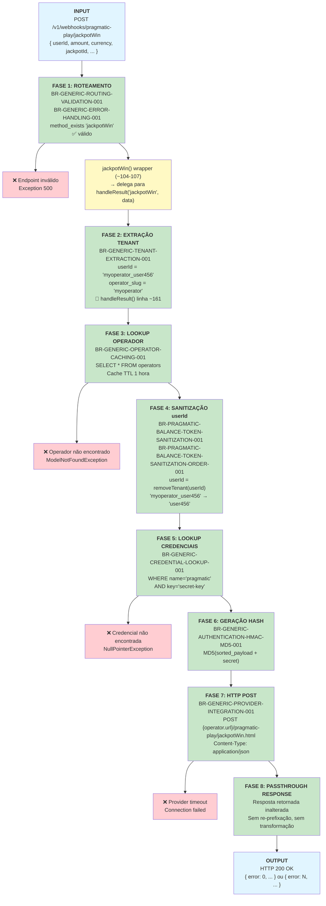

# Pragmatic Play `/jackpotWin` Endpoint — Documentação Técnica

**Endpoint:** `POST /v1/webhooks/pragmatic-play/jackpotWin`  
**Provider:** Pragmatic Play  
**Funcionalidade:** Registrar pagamento de jackpot ganho pelo jogador  
**Status:** ✅ Documentação Fase 2  

> 🏗️ **Família handleResult() — 3º membro:** `/jackpotWin` é o terceiro membro da família handleResult(). O wrapper público `jackpotWin()` (linhas ~104-107) delega para `handleResult('jackpotWin', data)` — a mesma lógica privada compartilhada com `/result`, `/bonusWin` e `/promoWin`. Referência canônica da família: `pragmatic-play-result.md`.

---

## 1. Resumo Executivo

O endpoint `/jackpotWin` registra o pagamento de um jackpot ganho pelo jogador. É um evento financeiramente significativo — valores geralmente maiores que resultados normais — que requer rastreabilidade independente para fins de auditoria e conformidade regulatória. Tecnicamente, compartilha 100% da implementação PHP com `/result` via `handleResult()`. A resposta é retornada **sem nenhuma modificação** (passthrough direto).

**Características:**
- ✅ Usa **apenas `userId`** como identificador
- ✅ **Passthrough** da resposta do provider — sem transformação
- ✅ Requer autenticação via hash MD5
- ✅ Multi-tenant com isolamento de operador
- ✅ **Sem regras exclusivas** — mesmas 9 regras genéricas
- 🏗️ **Arquitetura:** thin wrapper `jackpotWin()` → `handleResult('jackpotWin', data)`
- ⚠️ **Contexto crítico:** Evento de alto impacto financeiro — rastreabilidade separada exigida por operadores e reguladores

**Fonte PHP:**
- Wrapper: `PragmaticPlayService.php` — método `jackpotWin()`, linhas ~104-107
- Lógica: `PragmaticPlayService.php` — método `handleResult()`, linhas ~161-175

---

## 2. Fluxo de Requisição (Request → Response)



### Explicação das Fases

| Fase | Nome | Regra | Descrição |
|------|------|-------|-----------|
| 1 | Roteamento | BR-GENERIC-ROUTING-VALIDATION-001 + BR-GENERIC-ERROR-HANDLING-001 | `method_exists($service, 'jackpotWin')` → válido. Wrapper `jackpotWin()` delega imediatamente para `handleResult('jackpotWin', $data)`. |
| 2 | Extração Tenant | BR-GENERIC-TENANT-EXTRACTION-001 | Executado **dentro de `handleResult()`** (~linha 161). `userId.split('_')[0]` → `operator_slug`. |
| 3 | Lookup Operador | BR-GENERIC-OPERATOR-CACHING-001 | `OperatorService::get(userId)` com cache Redis TTL 1h. |
| 4 | Sanitização | BR-PRAGMATIC-BALANCE-TOKEN-SANITIZATION-001 + ORDER-001 | `removeTenant(userId)` remove o prefixo `operator_slug_`. Campo único. |
| 5 | Lookup Credenciais | BR-GENERIC-CREDENTIAL-LOOKUP-001 | `credentials.where('name','pragmatic').where('key','secret-key').first()->value` |
| 6 | Geração Hash | BR-GENERIC-AUTHENTICATION-HMAC-MD5-001 | `MD5(ksort(payload) + '&hash=' + secret)` |
| 7 | HTTP POST | BR-GENERIC-PROVIDER-INTEGRATION-001 | `postJson("{operator.url}/pragmatic-play/jackpotWin.html", payload)` — URL construída com argumento `'jackpotWin'`. |
| 8 | Passthrough | — | Resposta do provider retornada **sem nenhuma modificação**. |

---

## 3. Matriz de Regras Aplicáveis

| # | Regra | Descrição | Fase | Exclusiva? |
|---|-------|-----------|------|------------|
| 1 | **BR-GENERIC-ROUTING-VALIDATION-001** | Dynamic Endpoint Routing | 1 | Não |
| 2 | **BR-GENERIC-ERROR-HANDLING-001** | Unknown endpoint → Exception 500 | 1 (guard) | Não |
| 3 | **BR-GENERIC-TENANT-EXTRACTION-001** | Extrair `operator_slug` do `userId` | 2 | Não |
| 4 | **BR-GENERIC-OPERATOR-CACHING-001** | Operator lookup com cache 1h | 3 | Não |
| 5 | **BR-PRAGMATIC-BALANCE-TOKEN-SANITIZATION-001** | Remover prefixo tenant do `userId` | 4 | Não |
| 6 | **BR-PRAGMATIC-BALANCE-TOKEN-SANITIZATION-ORDER-001** | Sanitização de `userId` (campo único) | 4 | Não |
| 7 | **BR-GENERIC-CREDENTIAL-LOOKUP-001** | Buscar `secret-key` do operador | 5 | Não |
| 8 | **BR-GENERIC-AUTHENTICATION-HMAC-MD5-001** | Gerar hash MD5 (sort + concat + md5) | 6 | Não |
| 9 | **BR-GENERIC-PROVIDER-INTEGRATION-001** | HTTP POST para `{tenant_url}/pragmatic-play/jackpotWin.html` | 7 | Não |

> **Fase 8:** Passthrough direto — sem regra adicional. Resposta do provider retornada inalterada.  
> **Fonte das regras:** `docs/casino-proxy/phase-1-business-rules/pragmatic-play-rules.md`

---

## 4. Casos de Erro e Tratamento

### 4.1 `userId` Faltando no Payload

**Entrada:**
```json
{ "amount": 10000.00, "currency": "BRL", "jackpotId": "jp_mega_001" }
```

**Falha em:** Fase 2 — `handleResult()` linha ~161, `$data['userId']` é null

**Saída:**
```
Exception: Não foi possível encontrar um operator na string {null}
HTTP 500 Internal Server Error
```

---

### 4.2 `userId` sem Underscore (Formato Inválido)

**Entrada:**
```json
{ "userId": "semseparador", "amount": 10000.00, "currency": "BRL" }
```

**Falha em:** Fase 2 — parse do `operator_slug` falha

**Saída:**
```
Exception: Não foi possível encontrar um operator na string semseparador
HTTP 500 Internal Server Error
```

---

### 4.3 Operador Não Encontrado

**Entrada:**
```json
{ "userId": "operadorinexistente_user123", "amount": 10000.00, "currency": "BRL" }
```

**Falha em:** Fase 3 — `firstOrFail()` lança exceção

**Saída:**
```
Exception: No query results for model [App\Models\Operator]
HTTP 500 Internal Server Error
```

---

### 4.4 Credencial Pragmatic Faltando

**Falha em:** Fase 5 — `credentials->first()` retorna null

**Saída:**
```
Exception: Call to a member function value() on null
HTTP 500 Internal Server Error
```

---

### 4.5 Provider Timeout

**Falha em:** Fase 7 — `postJson()` sem retry (BaseService:19)

**Saída:**
```
Exception: Connection timeout / cURL error
HTTP 500 Internal Server Error
```

> **Nota crítica:** Timeout em `/jackpotWin` é especialmente impactante — o jogador não recebe confirmação do jackpot. O Casino Proxy não implementa retry, portanto a responsabilidade de reenvio é do provider.

---

### 4.6 Jackpot Rejeitado pelo Provider (`error != 0`)

**Provider responde:**
```json
{ "error": 5, "description": "Jackpot transaction already processed" }
```

**Comportamento em Fase 8:** Passthrough inalterado

**Saída para o cliente:**
```json
{ "error": 5, "description": "Jackpot transaction already processed" }
```

---

## 5. Exemplo Completo: Request → Response

### 5.1 Caso de Sucesso

**Cliente envia:**
```bash
curl -X POST http://localhost:8080/v1/webhooks/pragmatic-play/jackpotWin \
  -H "Content-Type: application/json" \
  -d '{
    "userId": "myoperator_user456",
    "amount": 10000.00,
    "currency": "BRL",
    "gameId": "vs20doghouse",
    "roundId": "round_abc789",
    "jackpotId": "jp_mega_001",
    "transactionId": "txn_jp_001"
  }'
```

**Processamento interno:**

| Fase | Operação | Input | Output |
|------|----------|-------|--------|
| 1 | Routing + Delegação | endpoint="jackpotWin" | `jackpotWin()` wrapper → `handleResult('jackpotWin', data)` |
| 2 | Tenant Extraction | userId="myoperator_user456" | operator_slug="myoperator" |
| 3 | Operator Lookup | slug="myoperator" | Operador + credentials (cache TTL 1h) |
| 4 | Sanitização | userId="myoperator_user456" | userId="user456" |
| 5 | Credencial | operador.credentials | secret="my_pp_secret_key" |
| 6 | Hash MD5 | sorted payload + secret | hash="e5f6a1b2c3d4..." |
| 7 | HTTP POST | `{url}/pragmatic-play/jackpotWin.html` | provider response recebida |
| 8 | **Passthrough** | response do provider | retornada inalterada |

**Provider responde:**
```json
{
  "error": 0,
  "description": "Success",
  "transactionId": "txn_jp_001",
  "currency": "BRL",
  "cash": 11475.50,
  "bonus": 0.00,
  "jackpotId": "jp_mega_001"
}
```

**Casino Proxy retorna (passthrough — inalterado):**
```bash
HTTP 200 OK
Content-Type: application/json

{
  "error": 0,
  "description": "Success",
  "transactionId": "txn_jp_001",
  "currency": "BRL",
  "cash": 11475.50,
  "bonus": 0.00,
  "jackpotId": "jp_mega_001"
}
```

---

## 6. Contexto de Negócio: `/jackpotWin` vs Família handleResult()

| Aspecto | `/result` | `/bonusWin` | `/jackpotWin` |
|---------|-----------|------------|--------------|
| **Evento** | Resultado de rodada | Pagamento de bônus | **Pagamento de jackpot** |
| **Frequência** | Alta (toda rodada) | Baixa (bônus especiais) | **Muito baixa (jackpots são raros)** |
| **Valores típicos** | Pequenos a médios | Pequenos a médios | **Altos (acumulado de muitos jogadores)** |
| **Rastreabilidade** | Padrão | Padrão | **Requerida separadamente por reguladores** |
| **Impacto de falha** | Baixo | Médio | **Alto — jogador perde confirmação de jackpot** |
| **handleResult() arg** | `'result'` | `'bonusWin'` | **`'jackpotWin'`** |
| **URL de destino** | `.../result.html` | `.../bonusWin.html` | `.../jackpotWin.html` |

> **Nota para implementação Go:** O handler Go deve rotear `/jackpotWin` como endpoint independente. Apesar da lógica PHP idêntica, considerar logging adicional ou alertas para eventos de jackpot — o impacto financeiro e regulatório justifica observabilidade extra.

---

## 7. Checklist de Segurança

| Validação | Implementada | Regra | Severidade |
|-----------|-------------|-------|------------|
| Tenant isolation (prefixo no userId) | ✅ | BR-GENERIC-TENANT-EXTRACTION-001 | CRÍTICA |
| Sanitização do userId antes de envio ao provider | ✅ | BR-PRAGMATIC-BALANCE-TOKEN-SANITIZATION-001 | CRÍTICA |
| Hash authentication (MD5) | ✅ | BR-GENERIC-AUTHENTICATION-HMAC-MD5-001 | CRÍTICA |
| Credencial por operador (secret-key isolado) | ✅ | BR-GENERIC-CREDENTIAL-LOOKUP-001 | CRÍTICA |
| Validação de endpoint (routing guard) | ✅ | BR-GENERIC-ERROR-HANDLING-001 | MÉDIA |
| HTTP method (POST only) | ✅ | routes/api.php | MÉDIA |

---

## 8. Limites e Restrições

| Restrição | Limite / Comportamento | Impacto |
|-----------|----------------------|---------|
| Identificador de entrada | Apenas `userId` (sem `token`) | Clientes devem sempre enviar `userId` |
| Formato do `userId` | Deve conter `_` como delimitador | `userId` sem `_` causa erro 500 |
| Response | Passthrough direto — sem transformação | O Casino Proxy não modifica o resultado do provider |
| Cache de operador | TTL 1 hora | Mudanças no operador levam até 1h para refletir |
| Retry automático | Desabilitado (BaseService:19) | Timeout = falha imediata — crítico para jackpots |
| Hash algorithm | MD5 | Compatibilidade com protocolo Pragmatic Play |

---

## 9. Referências

| Arquivo | Propósito |
|---------|-----------|
| `legacy/casino-proxy/app/Services/PragmaticPlayService.php:104-107` | Wrapper `jackpotWin()` |
| `PragmaticPlayService.php:161-175` | `handleResult()` — lógica compartilhada |
| `PragmaticPlayService.php:132-137` | Método `removeTenant()` |
| `PragmaticPlayService.php:142-152` | Método `generateHashCode()` |
| `OperatorService.php:20-34` | Método `get()` (tenant extraction + cache) |
| `BaseService.php:16-22` | Método `postJson()` |
| `docs/casino-proxy/phase-1-business-rules/pragmatic-play-rules.md` | Fonte das regras BR-* |
| `docs/casino-proxy/phase-2-technical-documentation/pragmatic-play-result.md` | Referência canônica da família handleResult() |

---

**Status:** ✅ Documentação Técnica Completa — Pronta para @qa review
