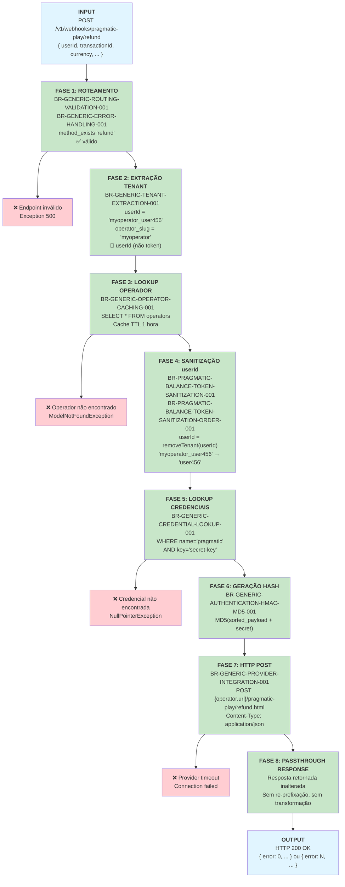

# Pragmatic Play `/refund` Endpoint — Documentação Técnica

**Endpoint:** `POST /v1/webhooks/pragmatic-play/refund`  
**Provider:** Pragmatic Play  
**Funcionalidade:** Estornar/cancelar uma aposta previamente registrada  
**Status:** ✅ Documentação Fase 2  

> 🔄 **Par Transacional:** `/refund` é o reverso do `/bet`. Estruturalmente idêntico (mesmas 9 regras, mesmo identificador `userId`, passthrough direto), diferindo apenas na URL de destino (`refund.html`) e no contexto de negócio: **estorno** em vez de registro de aposta.

---

## 1. Resumo Executivo

O endpoint `/refund` cancela ou estorna uma aposta previamente registrada via `/bet`. O Casino Proxy aplica o mesmo fluxo de 8 fases do `/bet`: extrai o tenant do `userId`, busca credenciais do operador, assina o payload com hash MD5 e faz o POST para o backend do provider. A resposta é retornada **sem nenhuma modificação** (passthrough direto).

**Características:**
- ✅ Usa **apenas `userId`** como identificador (idêntico ao `/bet`)
- ✅ **Passthrough** da resposta do provider — sem transformação alguma
- ✅ Requer autenticação via hash MD5
- ✅ Multi-tenant com isolamento de operador
- ✅ **Sem regras exclusivas** — mesmas 9 regras genéricas do `/bet`
- 🔄 Encerra o ciclo transacional iniciado pelo `/bet`

**Fonte PHP:** `PragmaticPlayService.php` — método `refund()`, linhas ~79-92

---

## 2. Fluxo de Requisição (Request → Response)



### Explicação das Fases

| Fase | Nome | Regra | Descrição |
|------|------|-------|-----------|
| 1 | Roteamento | BR-GENERIC-ROUTING-VALIDATION-001 + BR-GENERIC-ERROR-HANDLING-001 | `method_exists($service, 'refund')` → válido. Endpoint desconhecido lança Exception 500. |
| 2 | Extração Tenant | BR-GENERIC-TENANT-EXTRACTION-001 | `userId.split('_')[0]` → `operator_slug`. Usa `userId` (idêntico ao `/bet`). |
| 3 | Lookup Operador | BR-GENERIC-OPERATOR-CACHING-001 | `OperatorService::get(userId)` com cache Redis TTL 1h. `firstOrFail()` lança exceção se não encontrado. |
| 4 | Sanitização | BR-PRAGMATIC-BALANCE-TOKEN-SANITIZATION-001 + ORDER-001 | `removeTenant(userId)` remove o prefixo `operator_slug_`. Apenas `userId` — campo único. |
| 5 | Lookup Credenciais | BR-GENERIC-CREDENTIAL-LOOKUP-001 | `credentials.where('name','pragmatic').where('key','secret-key').first()->value` |
| 6 | Geração Hash | BR-GENERIC-AUTHENTICATION-HMAC-MD5-001 | `MD5(ksort(payload) + '&hash=' + secret)` |
| 7 | HTTP POST | BR-GENERIC-PROVIDER-INTEGRATION-001 | `postJson("{operator.url}/pragmatic-play/refund.html", payload)` |
| 8 | Passthrough | — | Resposta do provider retornada **sem nenhuma modificação**. |

---

## 3. Matriz de Regras Aplicáveis

| # | Regra | Descrição | Fase | Exclusiva? |
|---|-------|-----------|------|------------|
| 1 | **BR-GENERIC-ROUTING-VALIDATION-001** | Dynamic Endpoint Routing | 1 | Não |
| 2 | **BR-GENERIC-ERROR-HANDLING-001** | Unknown endpoint → Exception 500 | 1 (guard) | Não |
| 3 | **BR-GENERIC-TENANT-EXTRACTION-001** | Extrair `operator_slug` do `userId` | 2 | Não |
| 4 | **BR-GENERIC-OPERATOR-CACHING-001** | Operator lookup com cache 1h | 3 | Não |
| 5 | **BR-PRAGMATIC-BALANCE-TOKEN-SANITIZATION-001** | Remover prefixo tenant do `userId` | 4 | Não |
| 6 | **BR-PRAGMATIC-BALANCE-TOKEN-SANITIZATION-ORDER-001** | Sanitização de `userId` (campo único) | 4 | Não |
| 7 | **BR-GENERIC-CREDENTIAL-LOOKUP-001** | Buscar `secret-key` do operador | 5 | Não |
| 8 | **BR-GENERIC-AUTHENTICATION-HMAC-MD5-001** | Gerar hash MD5 (sort + concat + md5) | 6 | Não |
| 9 | **BR-GENERIC-PROVIDER-INTEGRATION-001** | HTTP POST para `{tenant_url}/pragmatic-play/refund.html` | 7 | Não |

> **Fase 8:** Passthrough direto — sem regra adicional. Resposta do provider retornada inalterada.  
> **Fonte das regras:** `docs/casino-proxy/phase-1-business-rules/pragmatic-play-rules.md`

### Uso de `userId` — Idêntico ao `/bet`

```php
// refund() — apenas userId (PragmaticPlayService.php:79-92)
$tenant = $this->operatorService->get($data['userId']);  // linha ~80
$data['userId'] = $this->removeTenant($data['userId']);  // linha ~85
// ex: "myoperator_user456" → "user456"
```

---

## 4. Casos de Erro e Tratamento

### 4.1 `userId` Faltando no Payload

**Entrada:**
```json
{ "transactionId": "txn_001", "currency": "BRL" }
```

**Falha em:** Fase 2 — BR-GENERIC-TENANT-EXTRACTION-001 (`$data['userId']` é null)

**Saída:**
```
Exception: Não foi possível encontrar um operator na string {null}
HTTP 500 Internal Server Error
```

---

### 4.2 `userId` sem Underscore (Formato Inválido)

**Entrada:**
```json
{ "userId": "semseparador", "transactionId": "txn_001", "currency": "BRL" }
```

**Falha em:** Fase 2 — parse do `operator_slug` falha (sem delimitador `_`)

**Saída:**
```
Exception: Não foi possível encontrar um operator na string semseparador
HTTP 500 Internal Server Error
```

---

### 4.3 Operador Não Encontrado

**Entrada:**
```json
{ "userId": "operadorinexistente_user123", "transactionId": "txn_001", "currency": "BRL" }
```

**Falha em:** Fase 3 — `OperatorService::get()` → `firstOrFail()` lança exceção

**Saída:**
```
Exception: No query results for model [App\Models\Operator]
HTTP 500 Internal Server Error
```

---

### 4.4 Credencial Pragmatic Faltando

**Falha em:** Fase 5 — `credentials->first()` retorna null, `.value` lança exceção

**Saída:**
```
Exception: Call to a member function value() on null
HTTP 500 Internal Server Error
```

---

### 4.5 Provider Timeout

**Falha em:** Fase 7 — `postJson()` sem retry (BaseService:19)

**Saída:**
```
Exception: Connection timeout / cURL error
HTTP 500 Internal Server Error
```

---

### 4.6 Estorno Rejeitado pelo Provider (`error != 0`)

**Entrada:** Payload válido, mas transação já estornada ou não encontrada no provider

**Provider responde:**
```json
{ "error": 1, "description": "Transaction not found or already refunded" }
```

**Comportamento em Fase 8:** Passthrough inalterado — sem transformação

**Saída para o cliente:**
```json
{ "error": 1, "description": "Transaction not found or already refunded" }
```

> **Nota:** Erros de negócio do provider retornam HTTP 200 OK. O campo `error` dentro do JSON indica o resultado da operação.

---

## 5. Exemplo Completo: Request → Response

### 5.1 Caso de Sucesso

**Cliente envia:**
```bash
curl -X POST http://localhost:8080/v1/webhooks/pragmatic-play/refund \
  -H "Content-Type: application/json" \
  -d '{
    "userId": "myoperator_user456",
    "transactionId": "txn_001",
    "currency": "BRL",
    "gameId": "vs20doghouse",
    "roundId": "round_abc789"
  }'
```

**Processamento interno:**

| Fase | Operação | Input | Output |
|------|----------|-------|--------|
| 1 | Routing | endpoint="refund" | `method_exists` → ✅ |
| 2 | Tenant Extraction | userId="myoperator_user456" | operator_slug="myoperator" |
| 3 | Operator Lookup | slug="myoperator" | Operador + credentials carregados (cache TTL 1h) |
| 4 | Sanitização | userId="myoperator_user456" | userId="user456" |
| 5 | Credencial | operador.credentials | secret="my_pp_secret_key" |
| 6 | Hash MD5 | sorted payload + secret | hash="b2c3d4e5f6a1..." |
| 7 | HTTP POST | `{url}/pragmatic-play/refund.html` | provider response recebida |
| 8 | **Passthrough** | response do provider | retornada inalterada |

**Payload enviado ao provider (após sanitização e hash):**
```json
{
  "userId": "user456",
  "transactionId": "txn_001",
  "currency": "BRL",
  "gameId": "vs20doghouse",
  "roundId": "round_abc789",
  "hash": "b2c3d4e5f6a1..."
}
```

**Provider responde:**
```json
{
  "error": 0,
  "description": "Success",
  "transactionId": "txn_001",
  "currency": "BRL",
  "cash": 1500.50,
  "bonus": 0.00
}
```

**Casino Proxy retorna (passthrough — inalterado):**
```bash
HTTP 200 OK
Content-Type: application/json

{
  "error": 0,
  "description": "Success",
  "transactionId": "txn_001",
  "currency": "BRL",
  "cash": 1500.50,
  "bonus": 0.00
}
```

---

## 6. Contexto de Negócio: Par Transacional `/bet` ↔ `/refund`

O `/bet` e `/refund` formam um par transacional que encapsula o ciclo de vida de uma aposta:

```
Jogador aposta
    │
    ▼
POST /bet ──────────── Registra a aposta, debita saldo
    │
    │  [resultado da rodada]
    │
    ├── Resultado resolvido ──→ POST /result (registra resultado)
    │
    └── Aposta cancelada ────→ POST /refund (estorna a aposta, credita saldo)
```

### Quando cada endpoint é chamado

| Endpoint | Disparado quando | Iniciador | Efeito no saldo |
|----------|-----------------|-----------|----------------|
| `/bet` | Jogador inicia uma rodada | Provider (Pragmatic Play) | Debita `amount` do saldo |
| `/refund` | Rodada é cancelada antes do resultado | Provider (Pragmatic Play) | Credita `amount` de volta |

### Cenários típicos de `/refund`

- **Timeout de rodada:** Rodada não foi concluída no tempo esperado
- **Erro de comunicação:** Falha de rede durante a rodada em andamento
- **Cancelamento pelo provider:** Provider detecta inconsistência e cancela a rodada
- **Rollback de sistema:** Manutenção ou falha do sistema do provider

### Identidade Estrutural com `/bet`

O `/refund` é **tecnicamente idêntico ao `/bet`** em implementação PHP:

```php
// bet() — PragmaticPlayService.php:64-77
public function bet($data) {
    $tenant = $this->operatorService->get($data['userId']);
    $data['userId'] = $this->removeTenant($data['userId']);
    $secret = $tenant->credentials()->where('name','pragmatic')->where('key','secret-key')->first()->value;
    $data['hash'] = $this->generateHashCode($data, $secret);
    return $this->postJson($tenant['url'] . '/pragmatic-play/bet.html', $data);
}

// refund() — PragmaticPlayService.php:79-92
public function refund($data) {
    $tenant = $this->operatorService->get($data['userId']);
    $data['userId'] = $this->removeTenant($data['userId']);
    $secret = $tenant->credentials()->where('name','pragmatic')->where('key','secret-key')->first()->value;
    $data['hash'] = $this->generateHashCode($data, $secret);
    return $this->postJson($tenant['url'] . '/pragmatic-play/refund.html', $data);  // ← única diferença
}
```

A única diferença entre os dois métodos é a URL de destino: `bet.html` vs `refund.html`.

---

## 7. Checklist de Segurança

| Validação | Implementada | Regra | Severidade |
|-----------|-------------|-------|------------|
| Tenant isolation (prefixo no userId) | ✅ | BR-GENERIC-TENANT-EXTRACTION-001 | CRÍTICA |
| Sanitização do userId antes de envio ao provider | ✅ | BR-PRAGMATIC-BALANCE-TOKEN-SANITIZATION-001 | CRÍTICA |
| Hash authentication (MD5) | ✅ | BR-GENERIC-AUTHENTICATION-HMAC-MD5-001 | CRÍTICA |
| Credencial por operador (secret-key isolado) | ✅ | BR-GENERIC-CREDENTIAL-LOOKUP-001 | CRÍTICA |
| Validação de endpoint (routing guard) | ✅ | BR-GENERIC-ERROR-HANDLING-001 | MÉDIA |
| HTTP method (POST only) | ✅ | routes/api.php | MÉDIA |

---

## 8. Limites e Restrições

| Restrição | Limite / Comportamento | Impacto |
|-----------|----------------------|---------|
| Identificador de entrada | Apenas `userId` (sem `token`) | Clientes devem sempre enviar `userId` |
| Formato do `userId` | Deve conter `_` como delimitador | `userId` sem `_` causa erro 500 |
| Response | Passthrough direto — sem transformação | O Casino Proxy não modifica o resultado do provider |
| Cache de operador | TTL 1 hora | Mudanças no operador levam até 1h para refletir |
| Retry automático | Desabilitado (BaseService:19) | Timeout do provider = falha imediata |
| Hash algorithm | MD5 | Compatibilidade com protocolo Pragmatic Play |
| Idempotência | Não garantida pelo Casino Proxy | Depende do provider gerenciar estornos duplicados |

---

## 9. Referências

| Arquivo | Propósito |
|---------|-----------|
| `legacy/casino-proxy/app/Services/PragmaticPlayService.php:79-92` | Implementação `refund()` |
| `PragmaticPlayService.php:85` | Sanitização do `userId` (`removeTenant`) |
| `PragmaticPlayService.php:132-137` | Método `removeTenant()` |
| `PragmaticPlayService.php:142-152` | Método `generateHashCode()` |
| `OperatorService.php:20-34` | Método `get()` (tenant extraction + cache) |
| `BaseService.php:16-22` | Método `postJson()` |
| `docs/casino-proxy/phase-1-business-rules/pragmatic-play-rules.md` | Fonte das regras BR-* |
| `docs/casino-proxy/phase-2-technical-documentation/pragmatic-play-bet.md` | Template base desta documentação |

---

**Status:** ✅ Documentação Técnica Completa — Pronta para @qa review
