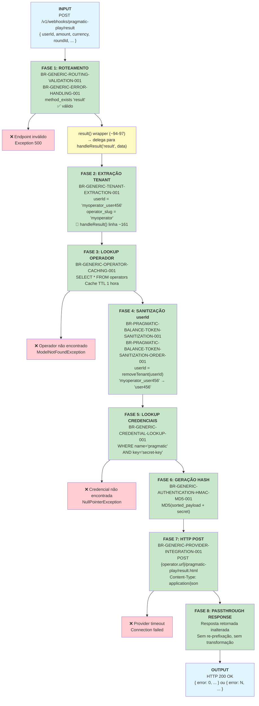

# Pragmatic Play `/result` Endpoint — Documentação Técnica

**Endpoint:** `POST /v1/webhooks/pragmatic-play/result`  
**Provider:** Pragmatic Play  
**Funcionalidade:** Registrar resultado/pagamento de uma rodada de jogo  
**Status:** ✅ Documentação Fase 2  

> 🏗️ **Família handleResult():** `/result` é o **primeiro e membro canônico** da família handleResult(). A lógica de negócio reside no método privado compartilhado `handleResult()` (linhas ~161-175), não no wrapper público `result()` (linhas ~94-97). Os endpoints `/bonusWin`, `/jackpotWin` e `/promoWin` seguem o mesmo padrão — thin wrapper → handleResult().

---

## 1. Resumo Executivo

O endpoint `/result` registra o resultado e o pagamento de uma rodada de jogo. É o endpoint mais frequente no fluxo de jogo — toda rodada iniciada com `/bet` termina com um `/result`. O Casino Proxy roteia a chamada através do wrapper público `result()` para o método privado `handleResult()`, que executa o fluxo completo de 8 fases: extração de tenant, lookup de operador, sanitização do `userId`, geração de hash MD5 e POST para o provider. A resposta é retornada **sem nenhuma modificação** (passthrough direto).

**Características:**
- ✅ Usa **apenas `userId`** como identificador
- ✅ **Passthrough** da resposta do provider — sem transformação
- ✅ Requer autenticação via hash MD5
- ✅ Multi-tenant com isolamento de operador
- ✅ **Sem regras exclusivas** — mesmas 9 regras genéricas do `/bet`
- 🏗️ **Arquitetura:** thin wrapper público → `handleResult()` privado compartilhado

**Fonte PHP:**
- Wrapper: `PragmaticPlayService.php` — método `result()`, linhas ~94-97
- Lógica: `PragmaticPlayService.php` — método `handleResult()`, linhas ~161-175

---

## 2. Fluxo de Requisição (Request → Response)



### Explicação das Fases

| Fase | Nome | Regra | Descrição |
|------|------|-------|-----------|
| 1 | Roteamento | BR-GENERIC-ROUTING-VALIDATION-001 + BR-GENERIC-ERROR-HANDLING-001 | `method_exists($service, 'result')` → válido. Wrapper `result()` delega imediatamente para `handleResult('result', $data)`. |
| 2 | Extração Tenant | BR-GENERIC-TENANT-EXTRACTION-001 | Executado **dentro de `handleResult()`** (~linha 161). `userId.split('_')[0]` → `operator_slug`. |
| 3 | Lookup Operador | BR-GENERIC-OPERATOR-CACHING-001 | `OperatorService::get(userId)` com cache Redis TTL 1h. |
| 4 | Sanitização | BR-PRAGMATIC-BALANCE-TOKEN-SANITIZATION-001 + ORDER-001 | `removeTenant(userId)` remove o prefixo `operator_slug_`. Apenas `userId` — campo único. |
| 5 | Lookup Credenciais | BR-GENERIC-CREDENTIAL-LOOKUP-001 | `credentials.where('name','pragmatic').where('key','secret-key').first()->value` |
| 6 | Geração Hash | BR-GENERIC-AUTHENTICATION-HMAC-MD5-001 | `MD5(ksort(payload) + '&hash=' + secret)` |
| 7 | HTTP POST | BR-GENERIC-PROVIDER-INTEGRATION-001 | `postJson("{operator.url}/pragmatic-play/result.html", payload)` — URL construída dinamicamente em handleResult() usando o argumento `'result'`. |
| 8 | Passthrough | — | Resposta do provider retornada **sem nenhuma modificação**. |

---

## 3. Matriz de Regras Aplicáveis

| # | Regra | Descrição | Fase | Exclusiva? |
|---|-------|-----------|------|------------|
| 1 | **BR-GENERIC-ROUTING-VALIDATION-001** | Dynamic Endpoint Routing | 1 | Não |
| 2 | **BR-GENERIC-ERROR-HANDLING-001** | Unknown endpoint → Exception 500 | 1 (guard) | Não |
| 3 | **BR-GENERIC-TENANT-EXTRACTION-001** | Extrair `operator_slug` do `userId` | 2 | Não |
| 4 | **BR-GENERIC-OPERATOR-CACHING-001** | Operator lookup com cache 1h | 3 | Não |
| 5 | **BR-PRAGMATIC-BALANCE-TOKEN-SANITIZATION-001** | Remover prefixo tenant do `userId` | 4 | Não |
| 6 | **BR-PRAGMATIC-BALANCE-TOKEN-SANITIZATION-ORDER-001** | Sanitização de `userId` (campo único) | 4 | Não |
| 7 | **BR-GENERIC-CREDENTIAL-LOOKUP-001** | Buscar `secret-key` do operador | 5 | Não |
| 8 | **BR-GENERIC-AUTHENTICATION-HMAC-MD5-001** | Gerar hash MD5 (sort + concat + md5) | 6 | Não |
| 9 | **BR-GENERIC-PROVIDER-INTEGRATION-001** | HTTP POST para `{tenant_url}/pragmatic-play/result.html` | 7 | Não |

> **Fase 8:** Passthrough direto — sem regra adicional. Resposta do provider retornada inalterada.  
> **Fonte das regras:** `docs/casino-proxy/phase-1-business-rules/pragmatic-play-rules.md`  
> **Onde as regras 3-9 são executadas:** Dentro de `handleResult()` — não no wrapper `result()`.

---

## 4. Casos de Erro e Tratamento

### 4.1 `userId` Faltando no Payload

**Entrada:**
```json
{ "amount": 10.00, "currency": "BRL", "roundId": "round_abc" }
```

**Falha em:** Fase 2 — `handleResult()` linha ~161, `$data['userId']` é null

**Saída:**
```
Exception: Não foi possível encontrar um operator na string {null}
HTTP 500 Internal Server Error
```

---

### 4.2 `userId` sem Underscore (Formato Inválido)

**Entrada:**
```json
{ "userId": "semseparador", "amount": 10.00, "currency": "BRL" }
```

**Falha em:** Fase 2 — parse do `operator_slug` falha (sem delimitador `_`)

**Saída:**
```
Exception: Não foi possível encontrar um operator na string semseparador
HTTP 500 Internal Server Error
```

---

### 4.3 Operador Não Encontrado

**Entrada:**
```json
{ "userId": "operadorinexistente_user123", "amount": 10.00, "currency": "BRL" }
```

**Falha em:** Fase 3 — `OperatorService::get()` → `firstOrFail()` lança exceção

**Saída:**
```
Exception: No query results for model [App\Models\Operator]
HTTP 500 Internal Server Error
```

---

### 4.4 Credencial Pragmatic Faltando

**Falha em:** Fase 5 — `credentials->first()` retorna null, `.value` lança exceção

**Saída:**
```
Exception: Call to a member function value() on null
HTTP 500 Internal Server Error
```

---

### 4.5 Provider Timeout

**Falha em:** Fase 7 — `postJson()` sem retry (BaseService:19)

**Saída:**
```
Exception: Connection timeout / cURL error
HTTP 500 Internal Server Error
```

---

### 4.6 Resultado Rejeitado pelo Provider (`error != 0`)

**Entrada:** Payload válido, mas `roundId` duplicado ou sessão inválida

**Provider responde:**
```json
{ "error": 3, "description": "Round already settled" }
```

**Comportamento em Fase 8:** Passthrough inalterado — sem transformação

**Saída para o cliente:**
```json
{ "error": 3, "description": "Round already settled" }
```

---

## 5. Exemplo Completo: Request → Response

### 5.1 Caso de Sucesso

**Cliente envia:**
```bash
curl -X POST http://localhost:8080/v1/webhooks/pragmatic-play/result \
  -H "Content-Type: application/json" \
  -d '{
    "userId": "myoperator_user456",
    "amount": 50.00,
    "currency": "BRL",
    "gameId": "vs20doghouse",
    "roundId": "round_abc789",
    "transactionId": "txn_result_001"
  }'
```

**Processamento interno:**

| Fase | Operação | Input | Output |
|------|----------|-------|--------|
| 1 | Routing + Delegação | endpoint="result" | `result()` wrapper → `handleResult('result', data)` |
| 2 | Tenant Extraction | userId="myoperator_user456" | operator_slug="myoperator" |
| 3 | Operator Lookup | slug="myoperator" | Operador + credentials carregados (cache TTL 1h) |
| 4 | Sanitização | userId="myoperator_user456" | userId="user456" |
| 5 | Credencial | operador.credentials | secret="my_pp_secret_key" |
| 6 | Hash MD5 | sorted payload + secret | hash="c3d4e5f6a1b2..." |
| 7 | HTTP POST | `{url}/pragmatic-play/result.html` | provider response recebida |
| 8 | **Passthrough** | response do provider | retornada inalterada |

**Payload enviado ao provider (após sanitização e hash):**
```json
{
  "userId": "user456",
  "amount": 50.00,
  "currency": "BRL",
  "gameId": "vs20doghouse",
  "roundId": "round_abc789",
  "transactionId": "txn_result_001",
  "hash": "c3d4e5f6a1b2..."
}
```

**Provider responde:**
```json
{
  "error": 0,
  "description": "Success",
  "transactionId": "txn_result_001",
  "currency": "BRL",
  "cash": 1525.50,
  "bonus": 0.00
}
```

**Casino Proxy retorna (passthrough — inalterado):**
```bash
HTTP 200 OK
Content-Type: application/json

{
  "error": 0,
  "description": "Success",
  "transactionId": "txn_result_001",
  "currency": "BRL",
  "cash": 1525.50,
  "bonus": 0.00
}
```

---

## 6. Família `handleResult()` — Arquitetura Compartilhada

### Padrão Arquitetural: Thin Wrapper → Shared Logic

O `/result` introduz um padrão de implementação distinto do `/bet` e `/refund`:

```
/bet    → bet()     [lógica inline, ~14 linhas]
/refund → refund()  [lógica inline, ~14 linhas]

/result     → result()     [wrapper, 1 linha] → handleResult('result', data)
/bonusWin   → bonusWin()   [wrapper, 1 linha] → handleResult('bonusWin', data)
/jackpotWin → jackpotWin() [wrapper, 1 linha] → handleResult('jackpotWin', data)
/promoWin   → promoWin()   [wrapper, 1 linha] → handleResult('promoWin', data)
```

### Código PHP — Wrapper vs. Lógica

```php
// result() — thin wrapper público (PragmaticPlayService.php:94-97)
public function result($data) {
    return $this->handleResult('result', $data);
}

// handleResult() — lógica privada compartilhada (PragmaticPlayService.php:161-175)
private function handleResult($endpoint, $data) {
    $tenant = $this->operatorService->get($data['userId']);          // linha ~161
    $data['userId'] = $this->removeTenant($data['userId']);          // linha ~162
    $secret = $tenant->credentials()
        ->where('name', 'pragmatic')
        ->where('key', 'secret-key')
        ->first()->value;                                             // linha ~165
    $data['hash'] = $this->generateHashCode($data, $secret);        // linha ~168
    return $this->postJson(
        $tenant['url'] . '/pragmatic-play/' . $endpoint . '.html',  // linha ~171
        $data
    );
}
```

### Tabela da Família — 4 Endpoints

| Endpoint | Wrapper PHP | Argumento `handleResult()` | URL destino | Contexto |
|----------|------------|---------------------------|-------------|---------|
| `/result` | `result()` ~94-97 | `'result'` | `.../result.html` | Resultado de rodada |
| `/bonusWin` | `bonusWin()` ~99-102 | `'bonusWin'` | `.../bonusWin.html` | Pagamento de bônus |
| `/jackpotWin` | `jackpotWin()` ~104-107 | `'jackpotWin'` | `.../jackpotWin.html` | Pagamento de jackpot |
| `/promoWin` | `promoWin()` ~109-112 | `'promoWin'` | `.../promoWin.html` | Prêmio promocional |

> Todos os 4 compartilham **100% da lógica** — a única diferença é o argumento de endpoint que determina a URL de destino.

### Implicação para Implementação Go

O handler Go pode replicar este padrão com uma função helper compartilhada:

```go
// Opção 1: função helper compartilhada
func handleResult(endpoint string, data map[string]any) (map[string]any, error) {
    // tenant extraction, operator lookup, sanitização, hash, POST
    url := operator.URL + "/pragmatic-play/" + endpoint + ".html"
    return postJSON(url, data)
}

func (s *Service) Result(data map[string]any) (map[string]any, error) {
    return handleResult("result", data)
}

func (s *Service) BonusWin(data map[string]any) (map[string]any, error) {
    return handleResult("bonusWin", data)
}
```

---

## 7. Checklist de Segurança

| Validação | Implementada | Regra | Severidade |
|-----------|-------------|-------|------------|
| Tenant isolation (prefixo no userId) | ✅ | BR-GENERIC-TENANT-EXTRACTION-001 | CRÍTICA |
| Sanitização do userId antes de envio ao provider | ✅ | BR-PRAGMATIC-BALANCE-TOKEN-SANITIZATION-001 | CRÍTICA |
| Hash authentication (MD5) | ✅ | BR-GENERIC-AUTHENTICATION-HMAC-MD5-001 | CRÍTICA |
| Credencial por operador (secret-key isolado) | ✅ | BR-GENERIC-CREDENTIAL-LOOKUP-001 | CRÍTICA |
| Validação de endpoint (routing guard) | ✅ | BR-GENERIC-ERROR-HANDLING-001 | MÉDIA |
| HTTP method (POST only) | ✅ | routes/api.php | MÉDIA |

---

## 8. Limites e Restrições

| Restrição | Limite / Comportamento | Impacto |
|-----------|----------------------|---------|
| Identificador de entrada | Apenas `userId` (sem `token`) | Clientes devem sempre enviar `userId` |
| Formato do `userId` | Deve conter `_` como delimitador | `userId` sem `_` causa erro 500 |
| Response | Passthrough direto — sem transformação | O Casino Proxy não modifica o resultado do provider |
| Cache de operador | TTL 1 hora | Mudanças no operador levam até 1h para refletir |
| Retry automático | Desabilitado (BaseService:19) | Timeout do provider = falha imediata |
| Hash algorithm | MD5 | Compatibilidade com protocolo Pragmatic Play |
| URL construída dinamicamente | `{tenant_url}/pragmatic-play/result.html` | Construída em `handleResult()` — depende do operador configurado |

---

## 9. Referências

| Arquivo | Propósito |
|---------|-----------|
| `legacy/casino-proxy/app/Services/PragmaticPlayService.php:94-97` | Wrapper `result()` |
| `PragmaticPlayService.php:161-175` | `handleResult()` — lógica compartilhada |
| `PragmaticPlayService.php:161` | Tenant extraction + cache (`userId`) |
| `PragmaticPlayService.php:132-137` | Método `removeTenant()` |
| `PragmaticPlayService.php:142-152` | Método `generateHashCode()` |
| `OperatorService.php:20-34` | Método `get()` (tenant extraction + cache) |
| `BaseService.php:16-22` | Método `postJson()` |
| `docs/casino-proxy/phase-1-business-rules/pragmatic-play-rules.md` | Fonte das regras BR-* |
| `docs/casino-proxy/phase-2-technical-documentation/pragmatic-play-bet.md` | Template base desta documentação |

---

**Status:** ✅ Documentação Técnica Completa — Pronta para @qa review
