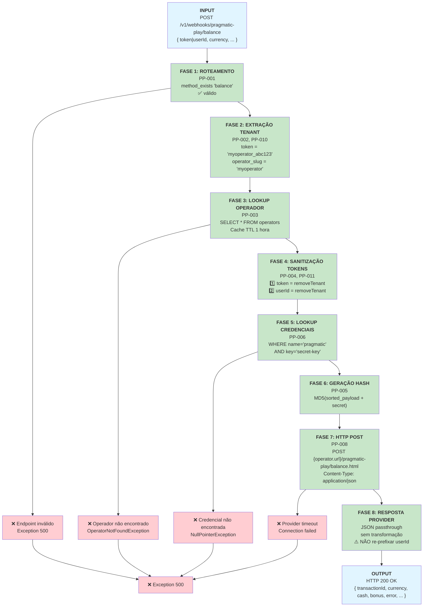

# Pragmatic Play `/balance` Endpoint — Documentação Técnica

**Endpoint:** `POST /v1/webhooks/pragmatic-play/balance`  
**Provider:** Pragmatic Play  
**Funcionalidade:** Consultar saldo atual da conta do jogador  
**Status:** ✅ Documentação de Fase 2 (Modelo para replicação)  

---

## 1. Resumo Executivo

O endpoint `/balance` é uma consulta de leitura que retorna o saldo atual de um jogador. Implementa autenticação baseada em tenant, sanitização de tokens e validação de credenciais.

**Características:**
- ✅ Suporta **dual token** (token OU userId)
- ✅ Retorna saldo sem modificar estado
- ✅ Requer autenticação via hash MD5
- ✅ Multi-tenant com isolamento de operador

---

## 2. Fluxo de Requisição (Request → Response)



---

## 3. Matriz de Regras Aplicáveis

| Regra | Descrição | Fase | Impacto |
|-------|-----------|------|---------|
| **PP-001** | Dynamic Endpoint Routing | 1 | Route `balance` para método `balance()` |
| **PP-002** | Tenant Extraction | 2 | Parse token/userId para operator_slug |
| **PP-003** | Operator Lookup + Cache | 3 | Query DB, cache 1 hora |
| **PP-004** | Token Sanitization | 4 | Remove prefixo tenant de token e userId |
| **PP-005** | MD5 Hash Generation | 6 | Calcula assinatura de autenticação |
| **PP-006** | Credential Lookup | 5 | Busca secret-key do operador |
| **PP-008** | HTTP POST to Provider | 7 | Envia para backend do operador |
| **PP-009** | Error Handling | 1 | Captura endpoint inválido |
| **PP-010** | Dual Token Support | 2 | Aceita token OU userId |
| **PP-011** | Sanitization Order | 4 | Ordem: token primeiro, userId depois |

---

## 4. Casos de Erro e Tratamento

### 4.1 Erro: Token Faltando

**Entrada:**
```json
{
  "currency": "BRL"
}
```

**Validação (PP-010):**
- Sem `token` → tenta `userId`
- Sem `userId` → error

**Saída:**
```
Exception: OperatorNotFoundException
HTTP 500 Internal Server Error
"Não foi possível encontrar um operator na string {null}."
```

**Cenário de Teste:** Requisição sem nenhum identificador de tenant

---

### 4.2 Erro: Operador Não Encontrado

**Entrada:**
```json
{
  "token": "unknown_xyz123",
  "currency": "BRL"
}
```

**Validação (PP-003):**
- Parse: operator_slug = "unknown"
- Query: SELECT * FROM operators WHERE slug = 'unknown'
- Resultado: NULL

**Saída:**
```
Exception: OperatorNotFoundException
HTTP 500 Internal Server Error
"erro padrao ... No query results found for model [App\Models\Operator]"
```

**Cenário de Teste:** Operador não cadastrado no sistema

---

### 4.3 Erro: Credencial Pragmatic Faltando

**Entrada:**
```json
{
  "token": "myoperator_abc123",
  "currency": "BRL"
}
```

**Validação (PP-006):**
- Operador encontrado ✅
- Query: SELECT * FROM credentials WHERE operator_id=X AND name='pragmatic' AND key='secret-key'
- Resultado: NULL (operador sem credenciais pragmatic)

**Saída:**
```
Exception: Call to a member function value() on null
HTTP 500 Internal Server Error
```

**Cenário de Teste:** Operador sem credenciais configuradas para Pragmatic Play

---

### 4.4 Erro: Provider Temporariamente Indisponível

**Entrada:**
```json
{
  "token": "myoperator_abc123",
  "userId": "myoperator_user456",
  "currency": "BRL"
}
```

**Fluxo:**
1. Fases 1-7 ✅
2. HTTP POST para provider: **TIMEOUT**
3. Sem retry (comentado em BaseService:19)

**Saída:**
```
Exception: Connection timeout
HTTP 500 Internal Server Error
"Failed to connect to provider"
```

**Cenário de Teste:** Falha de rede/indisponibilidade do provider

---

### 4.5 Erro: Hash Inválido (Rejeitado pelo Provider)

**Entrada:**
```json
{
  "token": "myoperator_abc123",
  "userId": "myoperator_user456",
  "currency": "BRL",
  "hash": "wrong_hash_value"
}
```

**Provider Response:**
```json
{
  "error": 403,
  "description": "Invalid signature"
}
```

**Saída:**
```
HTTP 200 OK (passthrough do provider)
{
  "error": 403,
  "description": "Invalid signature"
}
```

**Nota:** Casino Proxy apenas encaminha erro do provider. Validação de hash é responsabilidade do provider.

**Cenário de Teste:** Secret-key desincronizado entre Casino Proxy e Pragmatic Play

---

## 5. Exemplo Completo: Request → Response

### 5.1 Request Válido

**Cliente envia:**
```bash
curl -X POST http://localhost:8080/v1/webhooks/pragmatic-play/balance \
  -H "Content-Type: application/json" \
  -d '{
    "token": "myoperator_token123",
    "userId": "myoperator_player456",
    "currency": "BRL"
  }'
```

**Processamento interno:**

| Fase | Input | Operação | Output |
|------|-------|----------|--------|
| 1 | endpoint="balance" | method_exists($this, 'balance') | ✅ true |
| 2 | token="myoperator_token123" | split('_') | operator_slug="myoperator", token="token123" |
| 3 | operator_slug="myoperator" | Cache + DB query | Operador encontrado, credentials carregadas |
| 4 | token="token123", userId="player456" | removeTenant() | token="token123", userId="player456" |
| 5 | secret_key="my_secret_123" | Lookup credentials | ✅ Encontrado |
| 6 | payload | MD5 sort+concat | hash="abc123def456..." |
| 7 | full_payload + hash | POST | provider response recebida |
| 8 | provider_response | passthrough | sem transformação |

**Provider responde:**
```json
{
  "transactionId": "pp_12345",
  "currency": "BRL",
  "cash": 1500.50,
  "bonus": 250.00,
  "usedPromo": 0,
  "error": 0,
  "description": "Success"
}
```

**Casino Proxy retorna (identicamente):**
```bash
HTTP 200 OK
Content-Type: application/json

{
  "transactionId": "pp_12345",
  "currency": "BRL",
  "cash": 1500.50,
  "bonus": 250.00,
  "usedPromo": 0,
  "error": 0,
  "description": "Success"
}
```

---

## 6. Validações de Segurança

| Validação | Implementada | Local | Severidade |
|-----------|-------------|-------|------------|
| Tenant isolation (token prefix) | ✅ | PP-002, PP-004 | CRÍTICA |
| Hash authentication (MD5) | ✅ | PP-005, PP-006 | CRÍTICA |
| Operator existence | ✅ | PP-003 | ALTA |
| Credential presence | ✅ | PP-006 | ALTA |
| Endpoint validation | ✅ | PP-001 | MÉDIA |
| HTTP method validation | ✅ | routes/api.php | MÉDIA |

---

## 7. Limites e Restrições

| Restrição | Limite | Impacto |
|-----------|--------|---------|
| Cache TTL | 1 hora | Mudanças de operador levam até 1h para refletir |
| Retry automático | Desabilitado | Falha temporária do provider = erro imediato |
| Token format | Requer `_` | Sem underscore = parse error |
| Hash algorithm | MD5 | Compatibilidade com Pragmatic Play |
| Provider URL | Obrigatório | Sem URL = erro de integração |
| Secret key | Obrigatório | Sem secret = erro de autenticação |

---

## 8. Mudanças Esperadas de CASINO-1.7 Fase 1 para Fase 2

**Contexto:** CASINO-1.7 tem 5 Fases:
- **Fase 1:** Extrair regras de negócio (documento: `pragmatic-play-rules.md`)
- **Fase 2:** Documentar regras em formato técnico (documento: ESTE ARQUIVO - `pragmatic-play-balance.md`)
- **Fase 3-5:** Testes, matriz YAML, validação

| Aspecto | CASINO-1.7 Fase 1 | CASINO-1.7 Fase 2 |
|---------|------------------|-------------------|
| **Formato** | Lista de 12 regras isoladas (PP-001 a PP-012) | Fluxo integrado por endpoint |
| **Granularidade** | Por ponto de decisão/validação | Por endpoint (ex: /balance) |
| **Visualização** | Lista de regras com pseudocódigo | Mermaid flowchart com 8 fases |
| **Validação** | Rastreabilidade até código source | Teste de integração |
| **Público Alvo** | Arquitetos, análise técnica | Implementadores, QA |
| **Exemplo** | "Regra PP-005: Hash gerado com MD5" | "Fluxo completo do /balance: 8 fases do input até output" |
| **Uso** | Especificação de requisitos | Template para implementação/testes |

---

## 9. Checklist de Validação para Aprovação

- [ ] **Fluxo correto?** Todas as 8 fases descritas e em ordem?
- [ ] **Regras aplicadas?** Todas as 10 regras (PP-001, 002, 003, 004, 005, 006, 008, 009, 010, 011) contempladas?
- [ ] **Casos de erro?** Todos os 5 cenários de erro cobertos?
- [ ] **Diagrama claro?** Fluxo ASCII legível e completo?
- [ ] **Exemplo completo?** Request → Response funcional?
- [ ] **Limites documentados?** Restrições e trade-offs listados?
- [ ] **Pronto para Go?** Pseudocódigo suficiente para implementação?

---

**Status:** ✅ Documentação Técnica Completa (Awaiting PO/Architect Approval)

